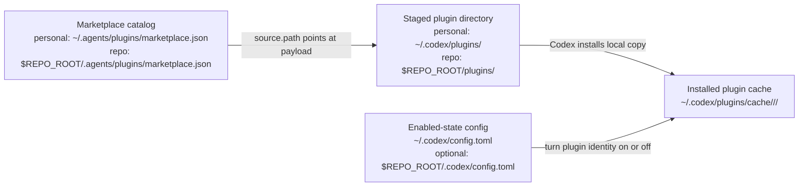

# Codex Plugin Install Surfaces

Use this document when maintainers need a durable map of how Codex's documented plugin surfaces fit together.

This is not a replacement for the official docs. It is a maintainer-focused translation layer for the parts that are easiest to blur together during local plugin work.

## Core Model

Codex plugin wiring has four different jobs on four different surfaces:

1. Marketplace catalog
   - Purpose: tell Codex which plugins are discoverable from a given marketplace.
   - Personal path: `~/.agents/plugins/marketplace.json`
   - Repo path: `$REPO_ROOT/.agents/plugins/marketplace.json`
2. Staged plugin directory
   - Purpose: hold the plugin payload on disk that a marketplace entry points at.
   - Common personal pattern: `~/.codex/plugins/<plugin-name>`
   - Common repo pattern from the docs: `$REPO_ROOT/plugins/<plugin-name>`
3. Installed plugin cache
   - Purpose: hold Codex's installed runtime copy.
   - Path: `~/.codex/plugins/cache/$MARKETPLACE_NAME/$PLUGIN_NAME/$VERSION/`
   - For local plugins, the documented version token is `local`.
4. Enabled-state config
   - Purpose: say whether a marketplace-scoped plugin is enabled or disabled.
   - Personal path: `~/.codex/config.toml`
   - Optional repo override path: `$REPO_ROOT/.codex/config.toml`

## Diagram



## What Each Surface Is Not

- A marketplace file is not the plugin payload.
- A marketplace file is not the enable or disable switch.
- A staged plugin directory is not the marketplace.
- The installed cache is not usually the place you edit directly.
- `config.toml` is not the install destination.

## Marketplace Identity

Codex tracks plugin enabled-state by plugin name plus marketplace name.

Example:

```toml
[plugins."agent-plugin-skills@socket"]
enabled = true
```

That means:

- `agent-plugin-skills` is the plugin name
- `socket` is the marketplace name
- the config entry is about that exact plugin identity from that exact marketplace

If you later rename the marketplace or switch the plugin to a different marketplace, the config identity changes too.

## Personal Scope

Personal scope means the catalog and enablement live in your home-directory Codex surfaces.

- Catalog: `~/.agents/plugins/marketplace.json`
- Common staged payload path: `~/.codex/plugins/<plugin-name>`
- Runtime cache: `~/.codex/plugins/cache/...`
- Enabled-state: `~/.codex/config.toml`

This is the clearest fit for plugins that are for your own Codex environment rather than part of a repository's visible plugin catalog.

## Repo Scope

Repo scope means the catalog is attached to one repository.

- Catalog: `$REPO_ROOT/.agents/plugins/marketplace.json`
- Common staged payload path from the docs: `$REPO_ROOT/plugins/<plugin-name>`
- Optional project-scoped enabled-state override: `$REPO_ROOT/.codex/config.toml`

Important nuance:

- The repo marketplace is still a catalog, not a private install vault.
- If the repo tracks that marketplace in git, it is advertising those plugins as part of the repo-visible Codex surface.
- OpenAI's documented Codex plugin model does not provide true repo-private plugin scoping beyond that visible repo marketplace model.

## Practical Reading Order

When a plugin looks wrong, inspect in this order:

1. marketplace entry
   - Is the plugin listed in the expected marketplace?
   - Does `source.path` point at the intended staged payload directory?
2. staged payload directory
   - Does the target directory exist?
   - Does it contain `.codex-plugin/plugin.json` and the expected bundled surfaces?
3. enabled-state
   - Is the plugin identity enabled in `config.toml`?
   - Is there a stale identity from an older marketplace name or scope?
4. installed cache
   - If Codex still behaves like an old version is installed, restart Codex and confirm the cache/install state refreshed.

## Common Failure Modes

- stale marketplace identity in `config.toml`
  - Example: `my-plugin@local-repo` remains enabled after the repo-local marketplace is gone.
- marketplace points at the wrong staged payload path
  - The plugin appears in the catalog, but Codex is reading the wrong files.
- staged payload drift
  - The repo source changed, but the staged plugin copy the marketplace points at was not updated.
- confusion between discovery mirrors and plugin packaging
  - A repo-local `.agents/skills` symlink mirror is not the same thing as a packaged plugin root.

## This Repository's Position

This repository is intentionally source-first.

- Root `skills/` is canonical.
- `.agents/skills` and `.claude/skills` are local authoring mirrors.
- This repository does not track a nested repo-local Codex plugin install surface for itself.
- This repository does not track a repo-local marketplace file for itself.

That means repo-local discovery mirrors in this repository should not be described as packaged plugin install roots.

## Official References

- [OpenAI Codex plugin build docs](https://developers.openai.com/codex/plugins/build)
- [How Codex uses marketplaces](https://developers.openai.com/codex/plugins/build#how-codex-uses-marketplaces)
- [Install a local plugin manually](https://developers.openai.com/codex/plugins/build#install-a-local-plugin-manually)
- [Marketplace metadata](https://developers.openai.com/codex/plugins/build#marketplace-metadata)
- [Remove or turn off a plugin](https://developers.openai.com/codex/plugins#remove-or-turn-off-a-plugin)
