# Maintainer Workflow Atlas

This document is maintainer-only. It is the repo-level workflow reference for every skill in this repository.

It diagrams real current workflows, captures their inputs and outputs, and describes the public Agent+Skill UX. Audit procedure, review criteria, and maintainer operating rules live in `docs/maintainers/reality-audit.md`.

## Repo-Wide Conventions

- `Workflow`: a logically grouped, user-meaningful path inside a skill.
- `Primary workflow`: the default path the skill should follow first.
- `Variant`: a subordinate branch inside the grouped skill, not a separate skill.
- `User-facing output`: what the end user sees from the Agent+Skill interaction.
- `Internal branch`: a decision point driven by mode, auth, config, missing input, or compatibility handling.
- `No findings.`, `blocked`, `created`, `updated`, `check-only`, `apply`, `skills_readme_maintenance`, `roadmap_maintenance`, `duplicatePolicy`, `onUpdateWithoutToken`, `requireAbsoluteDateInConfirmation`, `outputStyle`, and `Executive Summary` use their current canonical repo meanings.

## Skill Index

| Skill | Canonical role | Workflows covered |
| --- | --- | --- |
| `code-slice-explainer` | Canonical code-slice walkthrough explainer | `explain a slice`, `compare slices`, detail-level variants |
| `project-docs-maintainer` | Canonical maintainer for `*-skills` README drift and checklist roadmap maintenance | `skills_readme_maintenance`, `roadmap_maintenance` |
| `project-workspace-cleaner` | Read-only cleanup audit | findings path, clean run, partial-results branch |
| `things-digest-generator` | Things planning digest builder | MCP-first, JSON fallback, executive output, clean run, missing-input failure |
| `things-reminders-manager` | Things reminder mutation workflow | create, update, `duplicatePolicy=ask-first`, `onUpdateWithoutToken` variants, blocked/disambiguation |

## `code-slice-explainer`

### Workflow: `explain a slice`

**Overview**

- Triggered when the user wants one bounded end-to-end walkthrough of how part of a codebase works.
- Primary workflow.
- `read-only`

**Inputs**

- User intent selecting a slice explanation
- Required: a feature, request, event, job, datum, or code path to follow
- Optional: detail level (`quick`, `standard`, `thorough`)
- Optional: focus modifiers such as data-shape-heavy, branch-heavy, boundary-heavy, or debugging-oriented

**Branch Conditions**

- Ambiguous entrypoint: explain the most likely slice and name the uncertainty
- Multiple meaningful branches: keep the mainline readable and note the alternates
- Incomplete code evidence: state uncertainty explicitly instead of inventing missing behavior

**Outputs**

- Structured narrative with `Slice summary`, `Walkthrough`, `Diagram`, and `Notes`
- Complete step chain in execution order
- Simple numbered diagram with branch markers and data-shape markers

**Public Interface / UX**

- The Agent presents this as a conversational slice walkthrough.
- The explanation begins with the incoming data shape and why it is entering the flow.
- The walkthrough then follows every meaningful step in order through boundaries, branch points, and transformations.
- The user can change detail density without losing meaningful steps.

**Diagram**

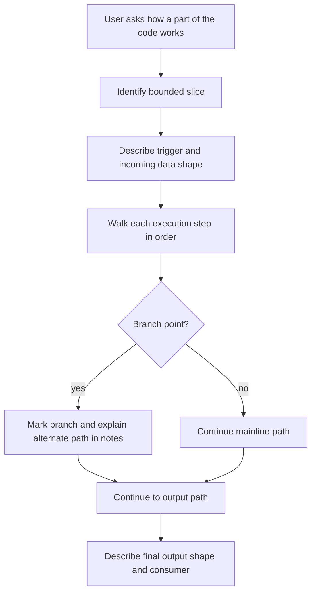
```mermaid
flowchart TD
  A["User asks how a part of the code works"] --> B["Identify bounded slice"]
  B --> C["Describe trigger and incoming data shape"]
  C --> D["Walk each execution step in order"]
  D --> E{"Branch point?"}
  E -- "yes" --> F["Mark branch and explain alternate path in notes"]
  E -- "no" --> G["Continue mainline path"]
  F --> H["Continue to output path"]
  G --> H
  H --> I["Describe final output shape and consumer"]
```

### Workflow: `compare slices`

**Overview**

- Triggered when the user wants to compare two related slices or two implementations of one slice.
- Variant workflow.
- `read-only`

**Inputs**

- User intent selecting a comparison
- Required: two slice targets or two versions of one slice
- Optional: detail level (`quick`, `standard`, `thorough`)
- Optional: same focus modifiers as the primary workflow

**Branch Conditions**

- Slices partially overlap: identify where they converge and diverge
- One slice is a branch of the other: say that directly
- Uneven evidence quality between the two slices: keep the comparison grounded and explicit about uncertainty

**Outputs**

- Two grounded slice explanations or concise summaries, depending on scope
- Comparison commentary covering trigger, data-shape, execution, boundary, branch, and output differences

**Public Interface / UX**

- The Agent should first make both paths understandable on their own.
- The comparison should stay tied to real execution and contract differences, not just filenames or component names.
- The user should be able to see why the slices differ, not only that they differ.

**Diagram**

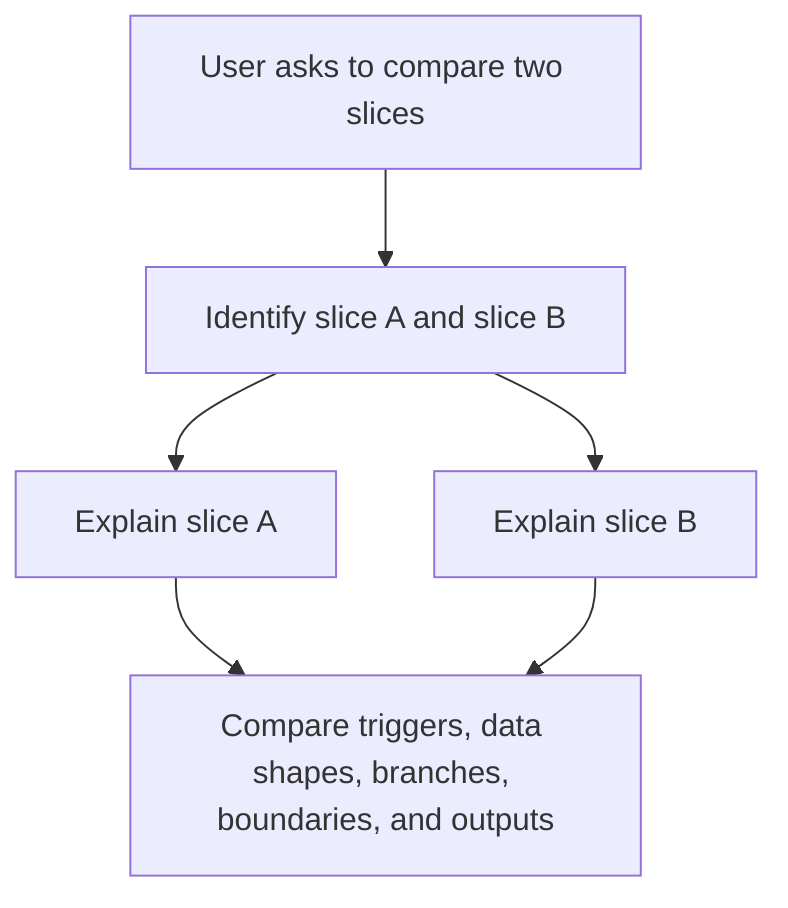
```mermaid
flowchart TD
  A["User asks to compare two slices"] --> B["Identify slice A and slice B"]
  B --> C["Explain slice A"]
  B --> D["Explain slice B"]
  C --> E["Compare triggers, data shapes, branches, boundaries, and outputs"]
  D --> E
```

## `project-docs-maintainer`

### Workflow: `skills_readme_maintenance` audit-only

**Overview**

- Triggered when the user wants `*-skills` README auditing without applying fixes.
- Primary workflow.
- `read-only`

**Inputs**

- User intent selecting `mode=skills_readme_maintenance`
- Required: `--workspace <path>`
- Optional: `--repo-glob <glob>`, repeatable `--exclude <path>`
- Tool/script input: `scripts/skills_readme_maintenance.py`

**Branch Conditions**

- Invalid workspace path: fatal validation failure
- Missing `README.md` in a scanned repo: schema-violation path
- README issues or command issues found: report path
- No issues and no errors: clean-run path

**Outputs**

- Markdown summary
- JSON report with `run_context`, `repos_scanned`, `profile_assignments`, `schema_violations`, `command_integrity_issues`, `fixes_applied`, `post_fix_status`, `errors`
- Exact clean-run text: `No findings.`

**Public Interface / UX**

- The Agent presents this as a read-only audit.
- The user provides workspace scope and optional repo filtering.
- No confirmation is needed because the workflow does not edit tracked files.
- The user receives either `No findings.` or a report of README and command-integrity issues.

**Diagram**

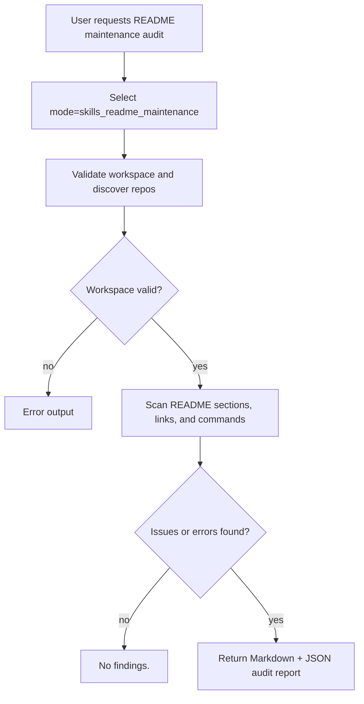
```mermaid
flowchart TD
  A["User requests README maintenance audit"] --> B["Select mode=skills_readme_maintenance"]
  B --> C["Validate workspace and discover repos"]
  C --> D{"Workspace valid?"}
  D -- "no" --> E["Error output"]
  D -- "yes" --> F["Scan README sections, links, and commands"]
  F --> G{"Issues or errors found?"}
  G -- "no" --> H["No findings."]
  G -- "yes" --> I["Return Markdown + JSON audit report"]
```

### Workflow: `skills_readme_maintenance` audit plus bounded fixes

**Overview**

- Triggered when the user wants README maintenance fixes after or during audit.
- Variant of `skills_readme_maintenance`.
- `bounded-write`

**Inputs**

- Same inputs as audit-only
- Explicit write trigger: `--apply-fixes`

**Branch Conditions**

- Fixable issues present: apply bounded fixes
- No fixable issues: report/no-op branch
- Fix application error: error branch
- Post-fix re-check clean vs unresolved branch

**Outputs**

- Same Markdown and JSON report shape as audit-only
- `fixes_applied` populated when fixes or skipped no-op decisions occur
- Exact clean-run text: `No findings.` when no issues remain and no errors exist

**Public Interface / UX**

- The Agent presents this as audit-first, then bounded fix.
- The user explicitly opts into fixes.
- The Agent keeps writes bounded to `README.md` and separately-approved snippet insertions into `AGENTS.md`.
- The user sees what changed, what was skipped, and what remains unresolved.

**Diagram**

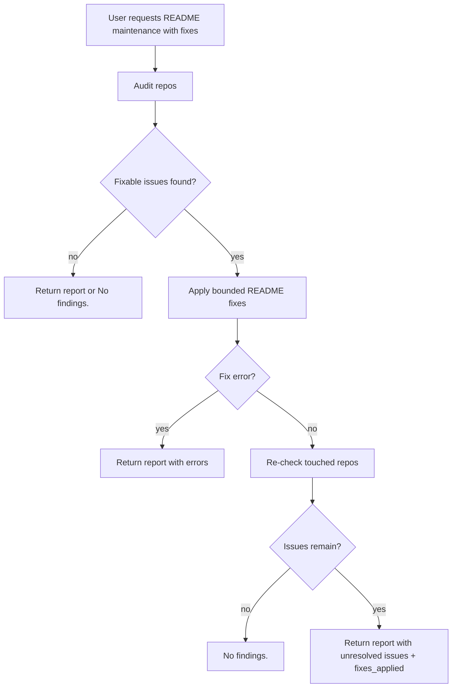
```mermaid
flowchart TD
  A["User requests README maintenance with fixes"] --> B["Audit repos"]
  B --> C{"Fixable issues found?"}
  C -- "no" --> D["Return report or No findings."]
  C -- "yes" --> E["Apply bounded README fixes"]
  E --> F{"Fix error?"}
  F -- "yes" --> G["Return report with errors"]
  F -- "no" --> H["Re-check touched repos"]
  H --> I{"Issues remain?"}
  I -- "no" --> J["No findings."]
  I -- "yes" --> K["Return report with unresolved issues + fixes_applied"]
```

### Workflow: `skills_readme_maintenance` clean run

**Overview**

- Triggered when audit or audit-plus-fixes ends with no issues and no errors.
- Variant end state of `skills_readme_maintenance`.
- `read-only` or `bounded-write`

**Inputs**

- Same inputs as the parent workflow

**Branch Conditions**

- No schema violations
- No command-integrity issues
- No errors

**Outputs**

- Exact output: `No findings.`

**Public Interface / UX**

- The Agent should present this as a completed maintenance pass with no action required.
- The user should not have to inspect a long report to confirm that the workflow ended cleanly.

**Diagram**

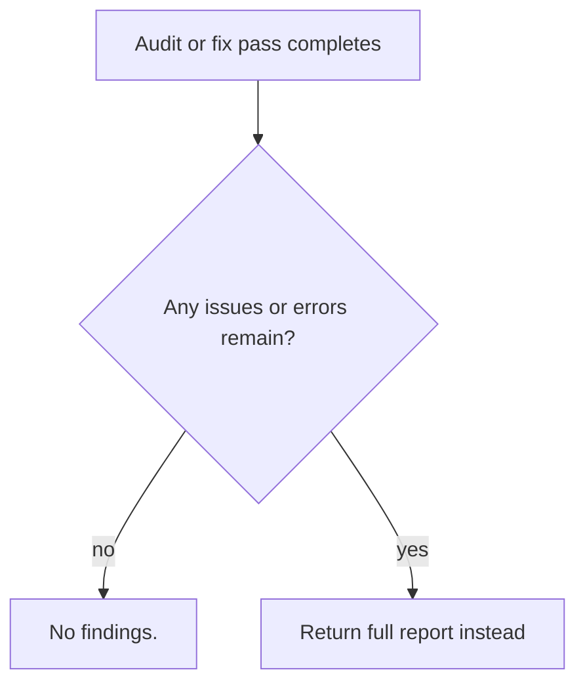
```mermaid
flowchart TD
  A["Audit or fix pass completes"] --> B{"Any issues or errors remain?"}
  B -- "no" --> C["No findings."]
  B -- "yes" --> D["Return full report instead"]
```

### Workflow: `skills_readme_maintenance` error or blocked path

**Overview**

- Triggered by invalid workspace or fix-time errors.
- Variant of `skills_readme_maintenance`.
- `read-only` or `bounded-write`

**Inputs**

- Same inputs as the parent workflow

**Branch Conditions**

- Invalid workspace path
- Exception during `apply_fixes`
- Repo-level processing error recorded in `errors`

**Outputs**

- Fatal validation error text on invalid workspace
- Or report with populated `errors`

**Public Interface / UX**

- The Agent should explain what failed and what minimum correction is needed.
- The workflow stops immediately only for fatal validation failures.

**Diagram**

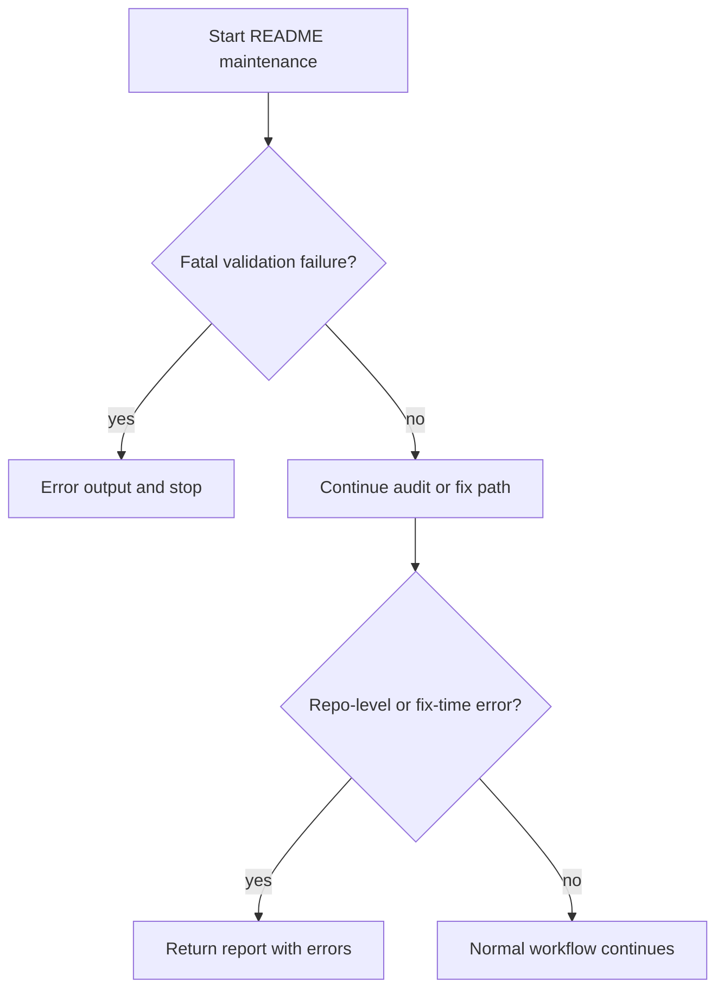
```mermaid
flowchart TD
  A["Start README maintenance"] --> B{"Fatal validation failure?"}
  B -- "yes" --> C["Error output and stop"]
  B -- "no" --> D["Continue audit or fix path"]
  D --> E{"Repo-level or fix-time error?"}
  E -- "yes" --> F["Return report with errors"]
  E -- "no" --> G["Normal workflow continues"]
```

### Workflow: `roadmap_maintenance` check-only

**Overview**

- Triggered when the user wants checklist roadmap validation without edits.
- Primary workflow for roadmap maintenance.
- `read-only`

**Inputs**

- User intent selecting `mode=roadmap_maintenance`
- Required: `--project-root <path>`, `--run-mode check-only`
- Optional: `--roadmap-path <path>`
- Tool/script input: `scripts/roadmap_alignment_maintainer.py`

**Branch Conditions**

- Invalid project root: fatal error
- Missing roadmap file: finding
- Legacy table-style format: migration-required finding
- Findings vs clean-run branch

**Outputs**

- Markdown plus JSON with `run_context`, `findings`, `apply_actions`, `errors`
- Exact clean-run text: `No findings.`

**Public Interface / UX**

- The Agent presents this as a validation-only roadmap check.
- The user provides a project root and optional roadmap path.
- The Agent does not edit files.
- The user sees either `No findings.` or a concise required-changes report.

**Diagram**

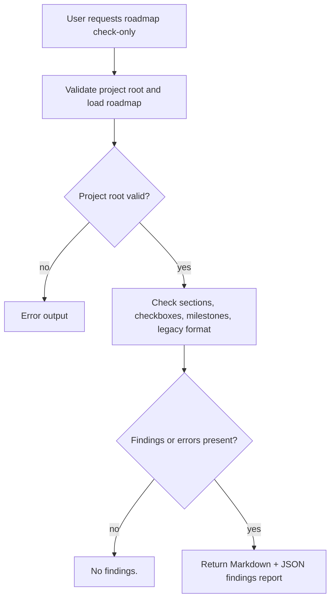
```mermaid
flowchart TD
  A["User requests roadmap check-only"] --> B["Validate project root and load roadmap"]
  B --> C{"Project root valid?"}
  C -- "no" --> D["Error output"]
  C -- "yes" --> E["Check sections, checkboxes, milestones, legacy format"]
  E --> F{"Findings or errors present?"}
  F -- "no" --> G["No findings."]
  F -- "yes" --> H["Return Markdown + JSON findings report"]
```

### Workflow: `roadmap_maintenance` apply

**Overview**

- Triggered when the user wants bounded roadmap normalization or creation.
- Variant of `roadmap_maintenance`.
- `bounded-write`

**Inputs**

- Required: `--project-root <path>`, `--run-mode apply`
- Optional: `--roadmap-path <path>`
- Same roadmap script

**Branch Conditions**

- Missing roadmap file: create branch
- Legacy format: migrate branch
- Non-legacy but normalization needed: update branch
- Apply error: error branch
- Post-apply clean vs unresolved branch

**Outputs**

- Markdown plus JSON with `findings`, `apply_actions`, `errors`
- `apply_actions` may include `created`, `migrated`, or `updated`
- Exact clean-run text: `No findings.`

**Public Interface / UX**

- The Agent presents this as a bounded apply path that edits only the roadmap file.
- The user explicitly requests `apply`.
- The user sees section-level change categories through `apply_actions`.

**Diagram**

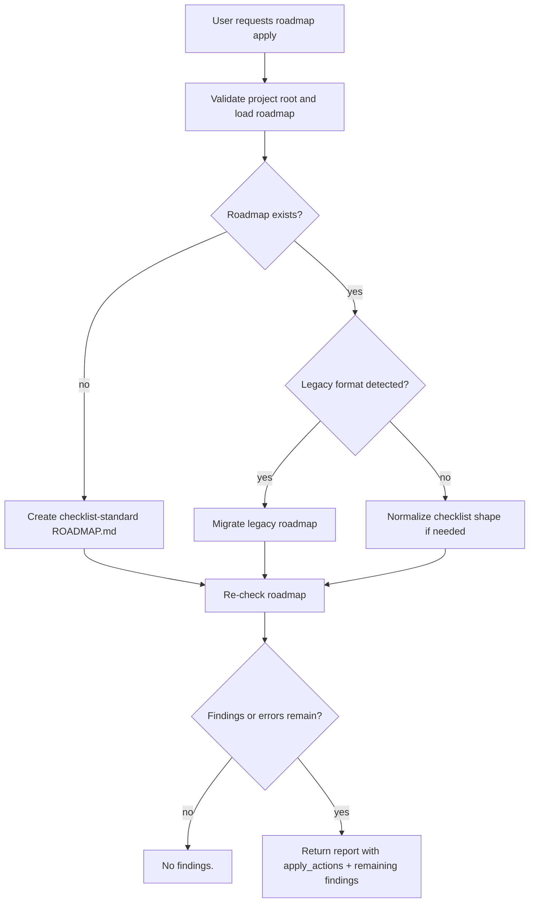
```mermaid
flowchart TD
  A["User requests roadmap apply"] --> B["Validate project root and load roadmap"]
  B --> C{"Roadmap exists?"}
  C -- "no" --> D["Create checklist-standard ROADMAP.md"]
  C -- "yes" --> E{"Legacy format detected?"}
  E -- "yes" --> F["Migrate legacy roadmap"]
  E -- "no" --> G["Normalize checklist shape if needed"]
  D --> H["Re-check roadmap"]
  F --> H
  G --> H
  H --> I{"Findings or errors remain?"}
  I -- "no" --> J["No findings."]
  I -- "yes" --> K["Return report with apply_actions + remaining findings"]
```

### Workflow: `roadmap_maintenance` clean run

**Overview**

- Triggered when check-only or apply ends with no findings and no errors.
- Variant end state of `roadmap_maintenance`.
- `read-only` or `bounded-write`

**Inputs**

- Same inputs as the parent workflow

**Branch Conditions**

- No findings
- No errors
- No remaining post-apply issues

**Outputs**

- Exact output: `No findings.`

**Public Interface / UX**

- The Agent should present this as a completed roadmap pass with no further action required.

**Diagram**

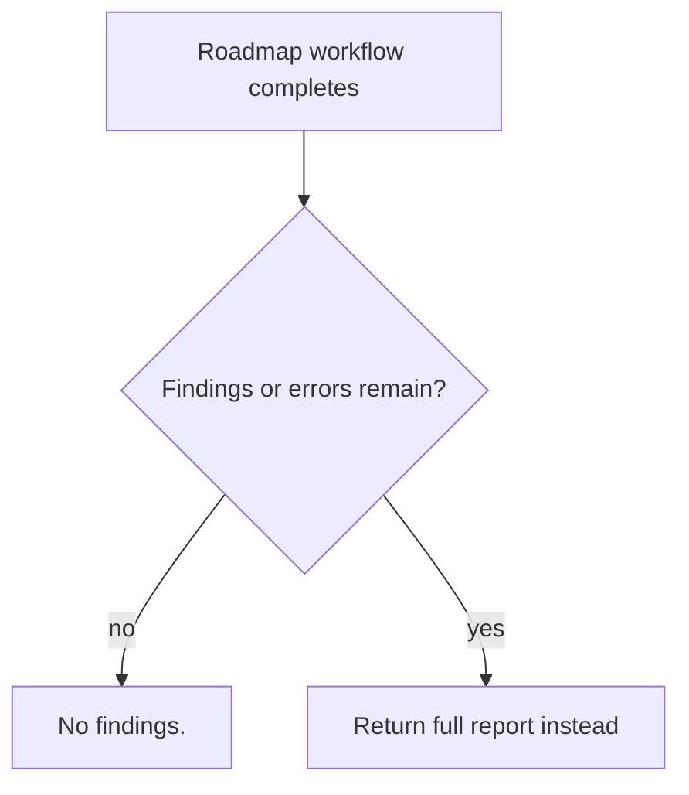
```mermaid
flowchart TD
  A["Roadmap workflow completes"] --> B{"Findings or errors remain?"}
  B -- "no" --> C["No findings."]
  B -- "yes" --> D["Return full report instead"]
```

### Workflow: `roadmap_maintenance` legacy-format migration branch

**Overview**

- Triggered when the roadmap contains legacy `Current Milestone` or `Milestones` table structures.
- Variant of `roadmap_maintenance`.
- `read-only` on check-only, `bounded-write` on apply

**Inputs**

- Same inputs as roadmap workflows
- Roadmap content matching legacy-format detection

**Branch Conditions**

- `check-only`: report migration required
- `apply`: migrate in place, then re-check

**Outputs**

- Check-only: finding with `legacy-roadmap-format`
- Apply: `apply_actions` includes `migrated`

**Public Interface / UX**

- The Agent should explain that checklist mode is canonical and that the roadmap is currently in a compatibility format.
- In check-only the workflow stops with required changes.
- In apply the migration is executed and reported.

**Diagram**

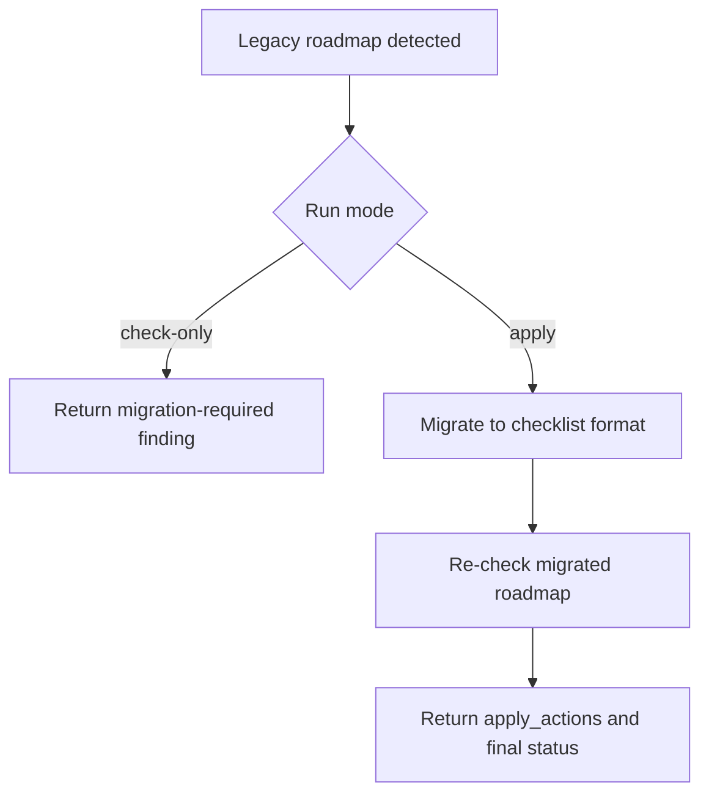
```mermaid
flowchart TD
  A["Legacy roadmap detected"] --> B{"Run mode"}
  B -- "check-only" --> C["Return migration-required finding"]
  B -- "apply" --> D["Migrate to checklist format"]
  D --> E["Re-check migrated roadmap"]
  E --> F["Return apply_actions and final status"]
```

### Workflow: `roadmap_maintenance` error or blocked path

**Overview**

- Triggered by invalid project root or apply errors.
- Variant of `roadmap_maintenance`.
- `read-only` or `bounded-write`

**Inputs**

- Same inputs as the parent workflow

**Branch Conditions**

- Fatal invalid project root
- Apply exception during create, migrate, or normalize

**Outputs**

- Fatal validation error text
- Or report with populated `errors`

**Public Interface / UX**

- The Agent should call out the exact blocked path or failing operation.
- Fatal validation failures stop immediately.
- Apply errors still return the roadmap report shape when possible.

**Diagram**

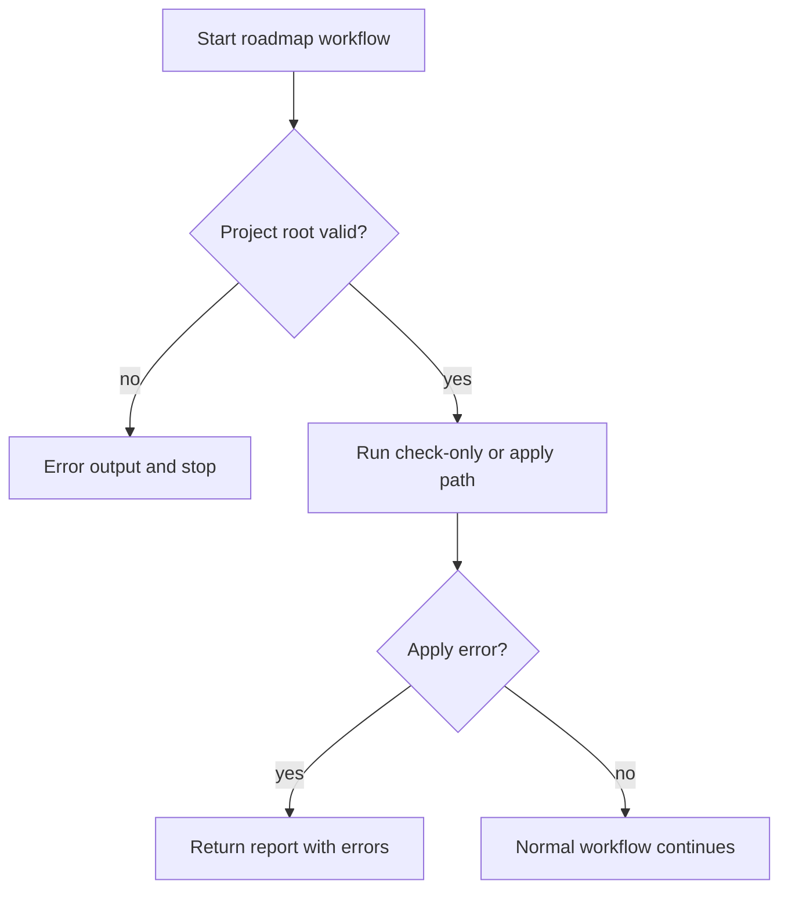
```mermaid
flowchart TD
  A["Start roadmap workflow"] --> B{"Project root valid?"}
  B -- "no" --> C["Error output and stop"]
  B -- "yes" --> D["Run check-only or apply path"]
  D --> E{"Apply error?"}
  E -- "yes" --> F["Return report with errors"]
  E -- "no" --> G["Normal workflow continues"]
```

## `project-workspace-cleaner`

### Workflow: read-only scan with findings

**Overview**

- Triggered when the user wants cleanup findings across a workspace.
- Primary workflow.
- `read-only`

**Inputs**

- Workspace root
- Optional overrides:
  - `--workspace`
  - `--min-mb`
  - `--stale-days`
  - `--max-findings`
  - `--config`
  - `--json`
- Script: `scripts/scan_workspace_cleanup.py`

**Branch Conditions**

- Matching artifact directories or files above thresholds produce findings
- Threshold and config values affect severity and inclusion

**Outputs**

- Text report or JSON output
- Per-finding fields:
  - `severity`
  - `repo`
  - `directory`
  - `category`
  - `size_human`
  - `score`
  - `why_flagged`
  - `suggested_cleanup`
- Repo summary totals

**Public Interface / UX**

- The Agent presents this as a read-only audit.
- The user provides scope and optional threshold tuning.
- The user sees ranked findings and repo summaries, not destructive actions.

**Diagram**

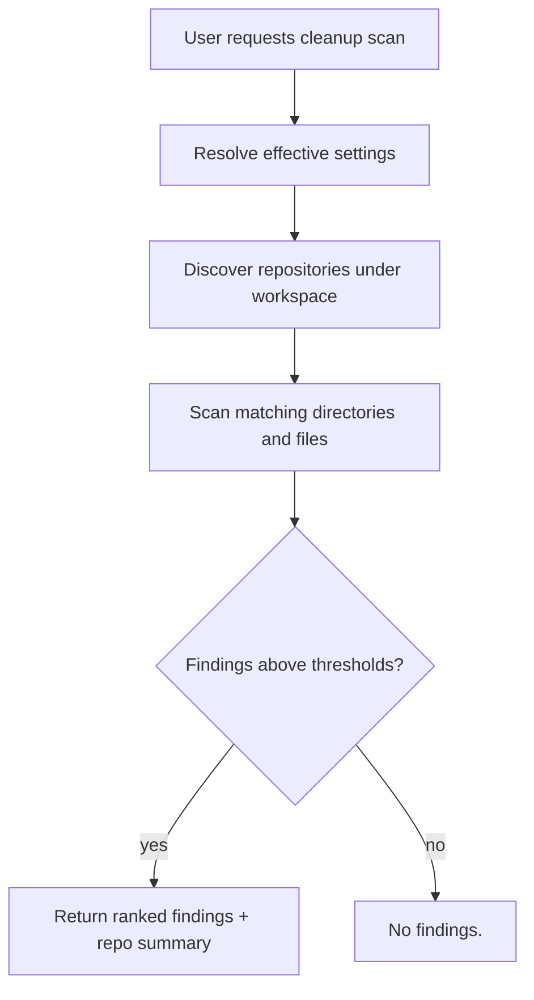
```mermaid
flowchart TD
  A["User requests cleanup scan"] --> B["Resolve effective settings"]
  B --> C["Discover repositories under workspace"]
  C --> D["Scan matching directories and files"]
  D --> E{"Findings above thresholds?"}
  E -- "yes" --> F["Return ranked findings + repo summary"]
  E -- "no" --> G["No findings."]
```

### Workflow: read-only clean run

**Overview**

- Triggered when the scan finds nothing above configured thresholds.
- Variant end state of workspace cleaner.
- `read-only`

**Inputs**

- Same inputs as the scan workflow

**Branch Conditions**

- No findings after scanning

**Outputs**

- Exact clean-run text: `No findings.`

**Public Interface / UX**

- The Agent can present this as a finished hygiene check with no cleanup needed.

**Diagram**

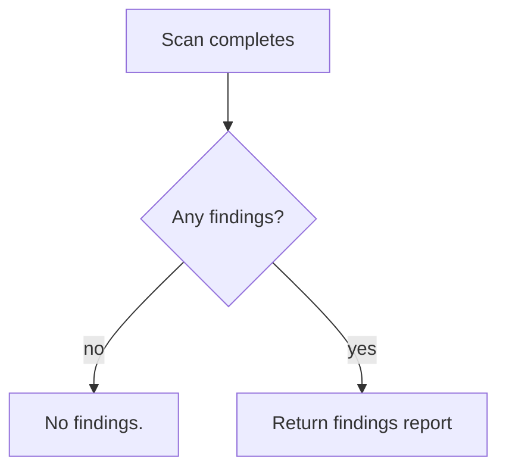
```mermaid
flowchart TD
  A["Scan completes"] --> B{"Any findings?"}
  B -- "no" --> C["No findings."]
  B -- "yes" --> D["Return findings report"]
```

### Workflow: inaccessible-path partial-results branch

**Overview**

- Triggered when some paths cannot be accessed while others remain scannable.
- Variant of workspace cleaner.
- `read-only`

**Inputs**

- Same inputs as the scan workflow
- Filesystem access realities

**Branch Conditions**

- Some path traversal or stat operations fail while the scan can continue elsewhere

**Outputs**

- Partial-results warning
- Findings report or `No findings in accessible paths.` from accessible paths
- `partial_results: true`
- `skipped_paths` list in JSON output

**Public Interface / UX**

- The Agent should call out skipped paths and continue where possible instead of failing the whole run.

**Diagram**

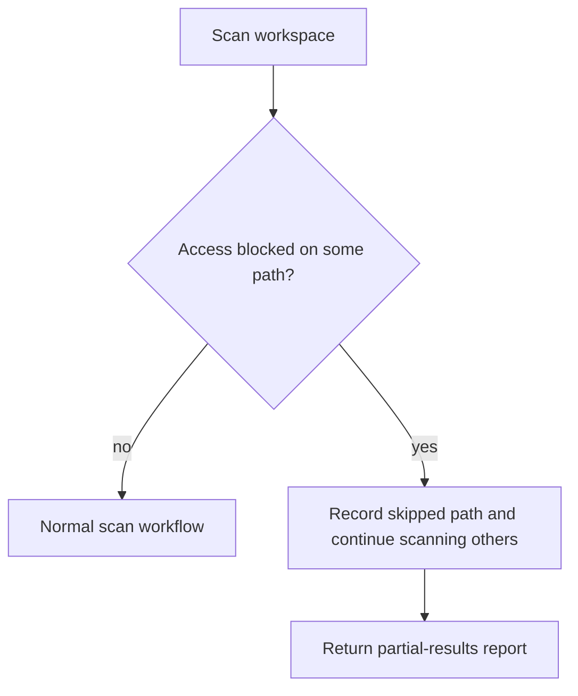
```mermaid
flowchart TD
  A["Scan workspace"] --> B{"Access blocked on some path?"}
  B -- "no" --> C["Normal scan workflow"]
  B -- "yes" --> D["Record skipped path and continue scanning others"]
  D --> E["Return partial-results report"]
```

## `things-digest-generator`

### Workflow: MCP-first digest generation

**Overview**

- Triggered when the user wants a Things planning digest and MCP reads are available.
- Primary workflow.
- `read-only`

**Inputs**

- Preferred MCP reads:
  - `things_read_areas`
  - `things_read_projects` with `status="open"`
  - `things_read_todos` with `status="open"`
  - `things_read_todos` with `status="completed"` and `completed_after=<today-7d>`
  - optional `things_read_todo`
- Optional overrides:
  - `--days-ahead`
  - `--due-soon-days`
  - `--top-projects`
  - `--top-areas`
  - `--max-suggestions`
  - `--open-count-cap`
  - `--output-style`
  - `--config`
  - `--today`

**Branch Conditions**

- No actionable data: clean-run branch
- `outputStyle=executive`: executive variant
- MCP unavailable: JSON fallback branch

**Outputs**

- Markdown beginning with `# Things Planning Digest - YYYY-MM-DD`
- Sections:
  - optional `Executive Summary`
  - `Snapshot`
  - `Recently Active`
  - `Week/Weekend Ahead`
  - `Suggestions`
- Exact clean-run text: `No findings.`

**Public Interface / UX**

- The Agent presents this as a planning digest, not a mutation workflow.
- The user typically provides only planning scope and optional tuning preferences.
- The Agent should surface concrete tasks and operational next actions.

**Diagram**

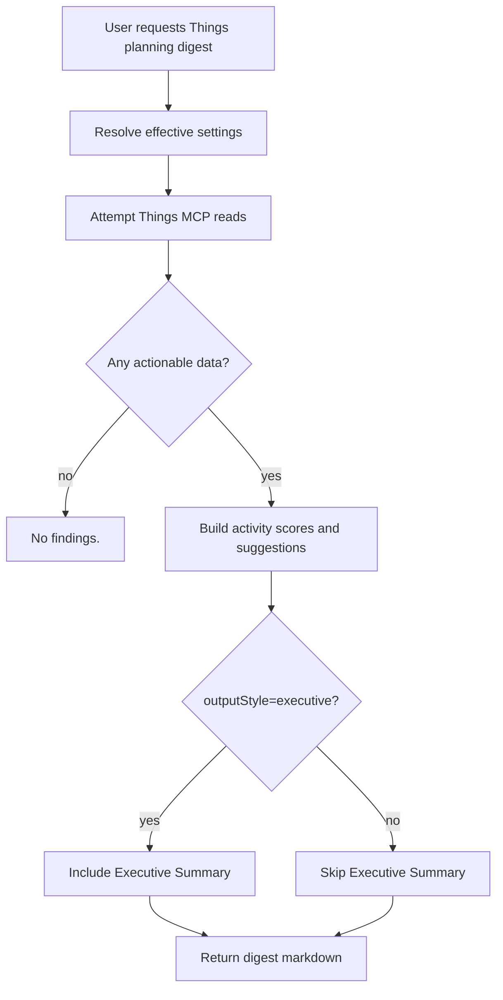
```mermaid
flowchart TD
  A["User requests Things planning digest"] --> B["Resolve effective settings"]
  B --> C["Attempt Things MCP reads"]
  C --> D{"Any actionable data?"}
  D -- "no" --> E["No findings."]
  D -- "yes" --> F["Build activity scores and suggestions"]
  F --> G{"outputStyle=executive?"}
  G -- "yes" --> H["Include Executive Summary"]
  G -- "no" --> I["Skip Executive Summary"]
  H --> J["Return digest markdown"]
  I --> J
```

### Workflow: JSON fallback digest generation

**Overview**

- Triggered when MCP is unavailable or when deterministic script input is preferred.
- Variant of digest generation.
- `read-only`

**Inputs**

- Required JSON files:
  - `--areas`
  - `--projects`
  - `--open-todos`
- Optional JSON files:
  - `--recent-done`
  - `--detailed-todos`

**Branch Conditions**

- Missing required JSON file: missing-input failure path
- No actionable data: clean-run branch
- `outputStyle=executive`: executive variant

**Outputs**

- Same markdown output contract as MCP-first
- Same clean-run text: `No findings.`

**Public Interface / UX**

- The Agent should explain that it is using exported or prepared JSON instead of live MCP data.

**Diagram**

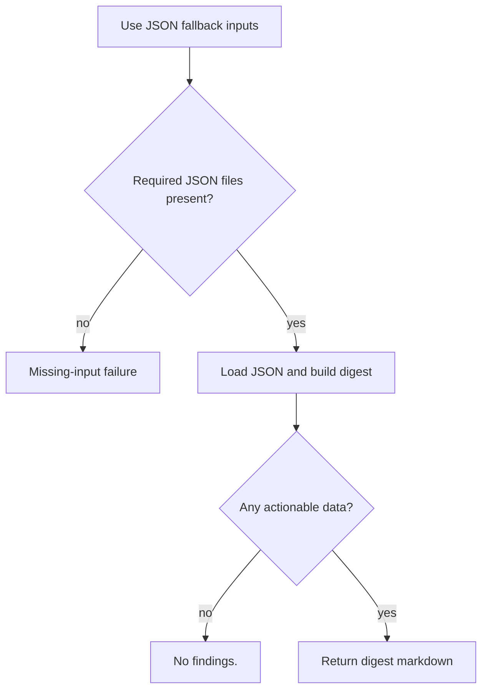
```mermaid
flowchart TD
  A["Use JSON fallback inputs"] --> B{"Required JSON files present?"}
  B -- "no" --> C["Missing-input failure"]
  B -- "yes" --> D["Load JSON and build digest"]
  D --> E{"Any actionable data?"}
  E -- "no" --> F["No findings."]
  E -- "yes" --> G["Return digest markdown"]
```

### Workflow: executive output variant

**Overview**

- Triggered when `outputStyle=executive`.
- Variant of digest generation.
- `read-only`

**Inputs**

- Any normal digest input path
- Config or override setting: `outputStyle=executive`

**Branch Conditions**

- `outputStyle=executive` adds `Executive Summary`
- Otherwise the digest omits it

**Outputs**

- Digest includes `## Executive Summary` before `Snapshot`

**Public Interface / UX**

- The Agent should signal that the digest is using executive summary-first presentation rather than the normal operational-only form.

**Diagram**

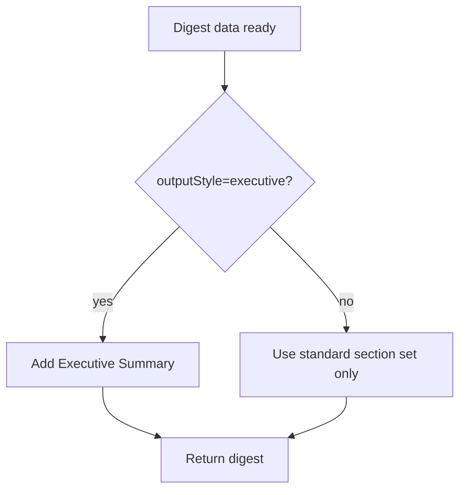
```mermaid
flowchart TD
  A["Digest data ready"] --> B{"outputStyle=executive?"}
  B -- "yes" --> C["Add Executive Summary"]
  B -- "no" --> D["Use standard section set only"]
  C --> E["Return digest"]
  D --> E
```

### Workflow: no-actionable-data clean run

**Overview**

- Triggered when there are no open todos and no recent completed todos.
- Variant end state of digest generation.
- `read-only`

**Inputs**

- Any digest input path

**Branch Conditions**

- No open todos
- No recent completed todos

**Outputs**

- Exact output: `No findings.`

**Public Interface / UX**

- The Agent should present this as a planning run with no current actionable data rather than as an error.

**Diagram**

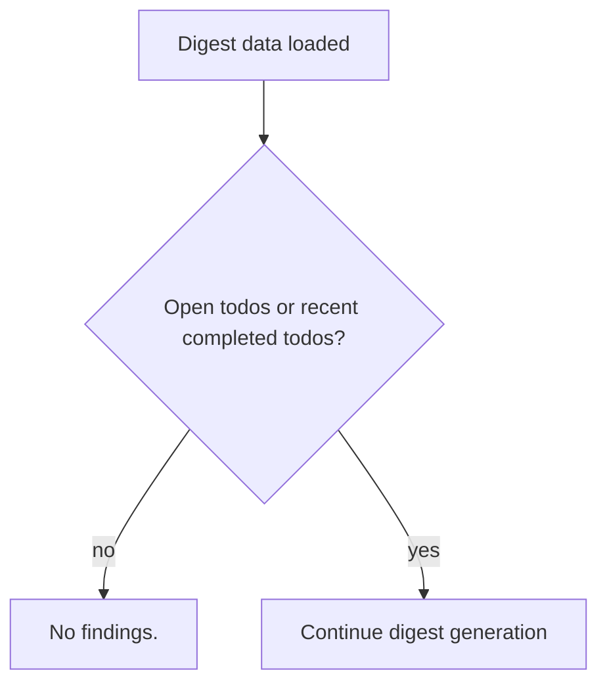
```mermaid
flowchart TD
  A["Digest data loaded"] --> B{"Open todos or recent completed todos?"}
  B -- "no" --> C["No findings."]
  B -- "yes" --> D["Continue digest generation"]
```

### Workflow: missing-input failure path

**Overview**

- Triggered when required digest inputs are missing or unavailable.
- Variant of digest generation.
- `read-only`

**Inputs**

- MCP permissions and availability
- JSON file availability when using fallback

**Branch Conditions**

- MCP unavailable and no fallback files
- JSON fallback selected with missing required files

**Outputs**

- Failure output as one deterministic `Input error:` line describing the missing file, unreadable path, invalid JSON, or unsupported JSON shape

**Public Interface / UX**

- The Agent should stop and explain what input is missing instead of inventing a partial digest.

**Diagram**

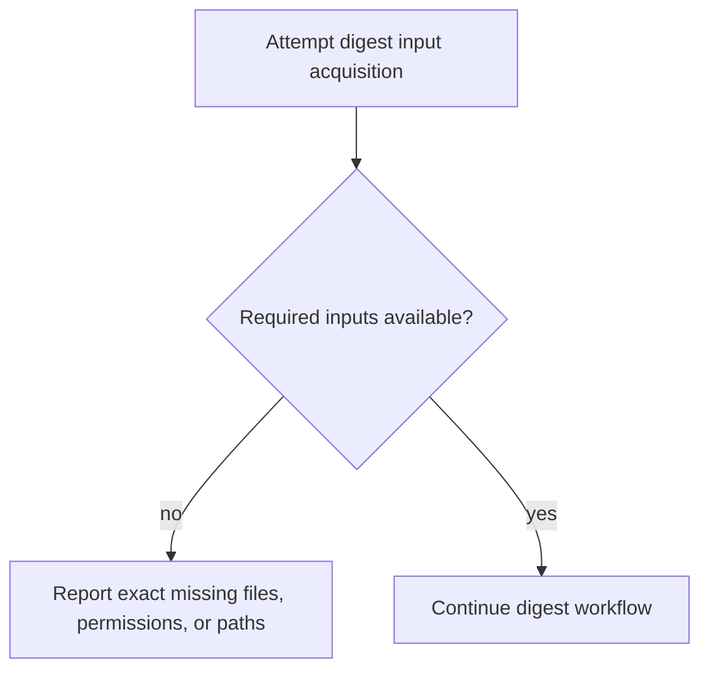
```mermaid
flowchart TD
  A["Attempt digest input acquisition"] --> B{"Required inputs available?"}
  B -- "no" --> C["Report exact missing files, permissions, or paths"]
  B -- "yes" --> D["Continue digest workflow"]
```

## `things-reminders-manager`

### Workflow: create path

**Overview**

- Triggered when the reminder request resolves to creating a new task.
- Primary path when there is no matching task or `duplicatePolicy=always-create`.
- `mutation-capable`

**Inputs**

- Reminder intent and requested schedule
- Effective settings:
  - `timezone`
  - `defaultReminderTime`
  - `duplicatePolicy`
  - `onUpdateWithoutToken`
  - `requireAbsoluteDateInConfirmation`
- MCP tools:
  - `things_capabilities`
  - `things_auth_get_status`
  - `things_find_todos`
  - `things_add_todo`

**Branch Conditions**

- No suitable open-task match found
- `duplicatePolicy=always-create`

**Outputs**

- `action: created`
- task title
- normalized absolute schedule
- blockers only if the path becomes blocked before creation

**Public Interface / UX**

- The Agent should confirm the normalized schedule in absolute form when required.
- The user should see that a new task was created rather than updated.

**Diagram**

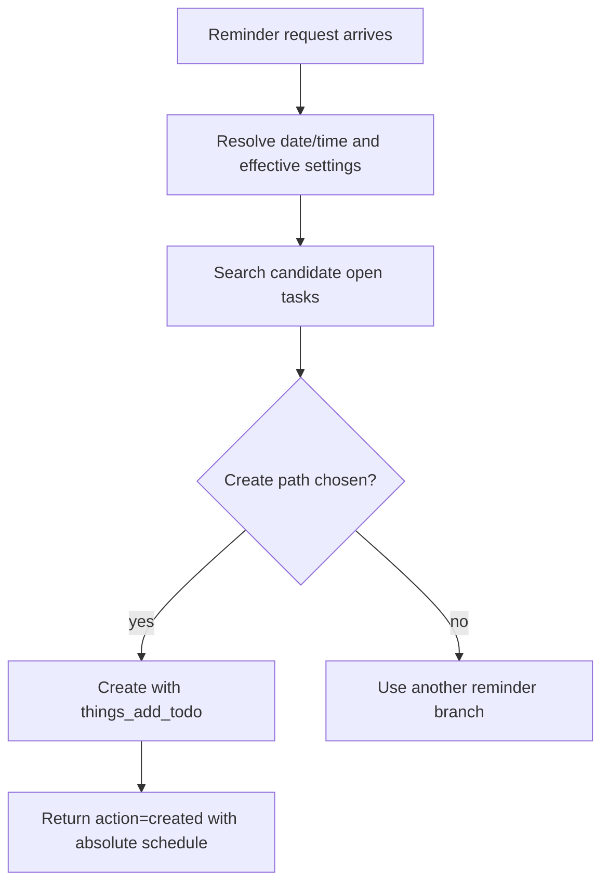
```mermaid
flowchart TD
  A["Reminder request arrives"] --> B["Resolve date/time and effective settings"]
  B --> C["Search candidate open tasks"]
  C --> D{"Create path chosen?"}
  D -- "yes" --> E["Create with things_add_todo"]
  D -- "no" --> F["Use another reminder branch"]
  E --> G["Return action=created with absolute schedule"]
```

### Workflow: update path

**Overview**

- Triggered when a single clear correction or reschedule match exists and update is allowed.
- Primary path under `duplicatePolicy=update-first`.
- `mutation-capable`

**Inputs**

- Same reminder inputs as create path
- MCP tools:
  - `things_validate_token_config`
  - `things_update_todo`

**Branch Conditions**

- Single clear correction/reschedule match
- Update auth available

**Outputs**

- `action: updated`
- task title
- normalized absolute schedule

**Public Interface / UX**

- The Agent should make clear that an existing task was updated rather than duplicated.

**Diagram**

```mermaid
flowchart TD
  A["Reminder request arrives"] --> B["Resolve settings and search candidates"]
  B --> C{"Single clear update match?"}
  C -- "no" --> D["Use another reminder branch"]
  C -- "yes" --> E{"Update auth available?"}
  E -- "no" --> F["Use onUpdateWithoutToken branch"]
  E -- "yes" --> G["Update with things_update_todo"]
  G --> H["Return action=updated with absolute schedule"]
```

### Workflow: `duplicatePolicy=ask-first` branch

**Overview**

- Triggered when a plausible duplicate exists and the effective policy is `ask-first`.
- Variant of reminder management.
- `mutation-capable` but paused for user choice

**Inputs**

- Same reminder inputs
- Effective setting: `duplicatePolicy=ask-first`

**Branch Conditions**

- Plausible duplicate candidate exists

**Outputs**

- User-facing disambiguation request
- No mutation until the user answers

**Public Interface / UX**

- The Agent should stop and ask the user which task to update or whether to create a new one.
- The workflow is user-visible and intentionally paused.

**Diagram**

```mermaid
flowchart TD
  A["Candidate duplicate found"] --> B{"duplicatePolicy=ask-first?"}
  B -- "yes" --> C["Ask user to choose update vs create"]
  B -- "no" --> D["Use another duplicatePolicy branch"]
```

### Workflow: `onUpdateWithoutToken=block-and-report` branch

**Overview**

- Triggered when update is required but token access is unavailable and the policy is `block-and-report`.
- Variant of reminder management.
- `blocked`

**Inputs**

- Same reminder inputs
- Effective setting: `onUpdateWithoutToken=block-and-report`

**Branch Conditions**

- Update path selected
- Token access unavailable

**Outputs**

- `action: blocked`
- blocker text
- no mutation

**Public Interface / UX**

- The Agent should stop automatically and explain the auth blocker.

**Diagram**

```mermaid
flowchart TD
  A["Update path selected"] --> B{"Token access available?"}
  B -- "yes" --> C["Continue update path"]
  B -- "no" --> D{"onUpdateWithoutToken=block-and-report?"}
  D -- "yes" --> E["Return action=blocked with blocker"]
```

### Workflow: `onUpdateWithoutToken=ask-to-create-duplicate` branch

**Overview**

- Triggered when update is required but token access is unavailable and the policy prefers user choice.
- Variant of reminder management.
- `mutation-capable` but paused for user choice

**Inputs**

- Same reminder inputs
- Effective setting: `onUpdateWithoutToken=ask-to-create-duplicate`

**Branch Conditions**

- Update path selected
- Token access unavailable

**Outputs**

- User-facing question asking whether to create a new task instead

**Public Interface / UX**

- The Agent should explain that update auth is missing and offer creation as a follow-up decision.

**Diagram**

```mermaid
flowchart TD
  A["Update path selected"] --> B{"Token access available?"}
  B -- "yes" --> C["Continue update path"]
  B -- "no" --> D{"onUpdateWithoutToken=ask-to-create-duplicate?"}
  D -- "yes" --> E["Ask user whether to create a new task instead"]
```

### Workflow: blocked or disambiguation path

**Overview**

- Triggered when the reminder workflow cannot continue automatically.
- Variant of reminder management.
- `blocked` or user-paused

**Inputs**

- Same reminder inputs

**Branch Conditions**

- Multiple likely matches
- Missing update auth under blocking policy
- Ambiguous schedule requiring clarification

**Outputs**

- `action: blocked` with blockers
- or a user-facing disambiguation request

**Public Interface / UX**

- The Agent should stop and tell the user what is needed next.
- The workflow must not silently mutate in these cases.

**Diagram**

```mermaid
flowchart TD
  A["Reminder workflow in progress"] --> B{"Automatic continuation safe?"}
  B -- "yes" --> C["Continue create or update path"]
  B -- "no" --> D{"Need user choice or hard block?"}
  D -- "user choice" --> E["Ask for disambiguation or confirmation"]
  D -- "hard block" --> F["Return action=blocked with blocker"]
```
