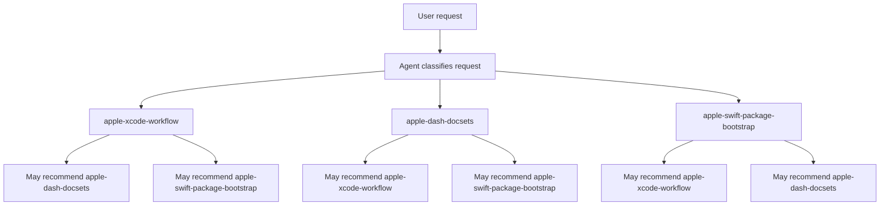
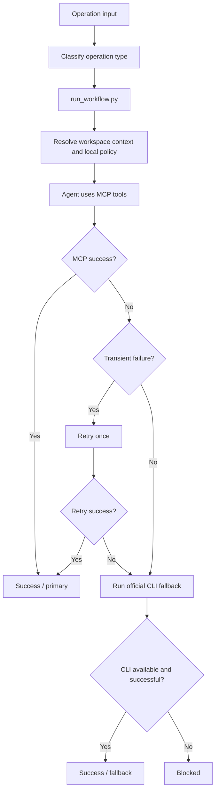
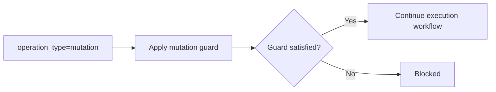
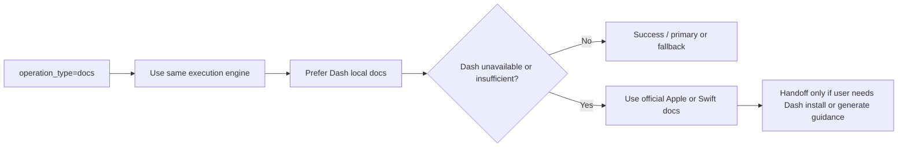
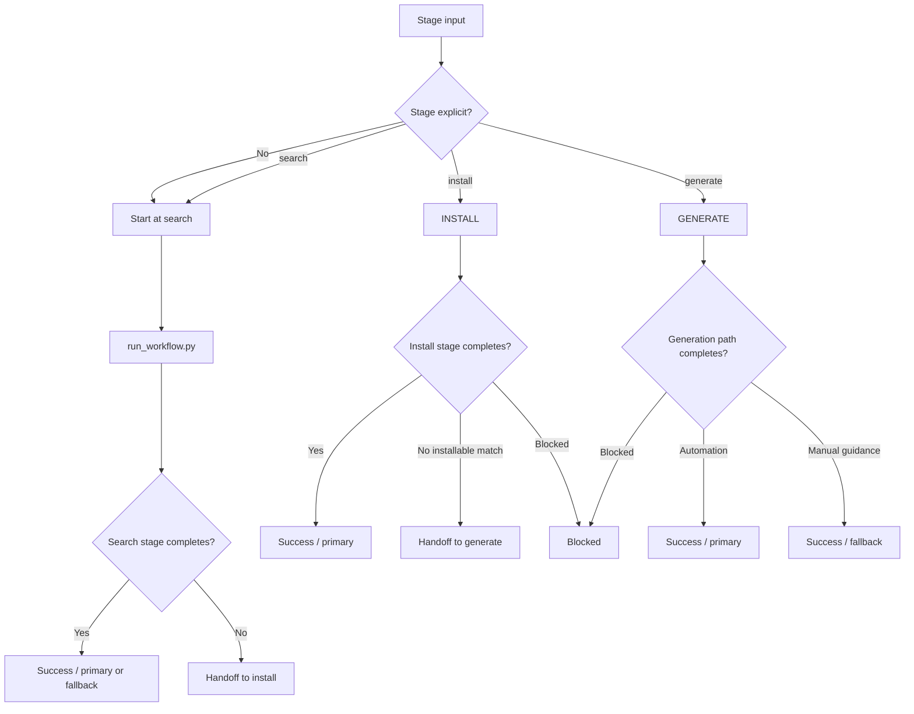
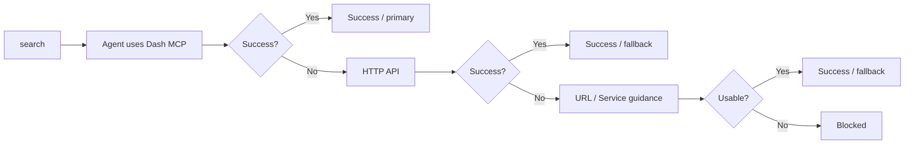
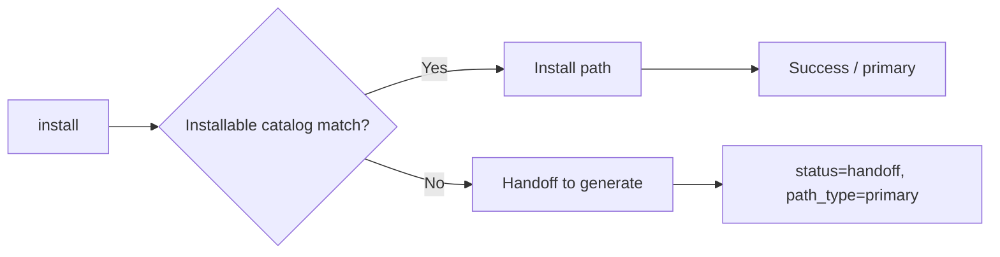
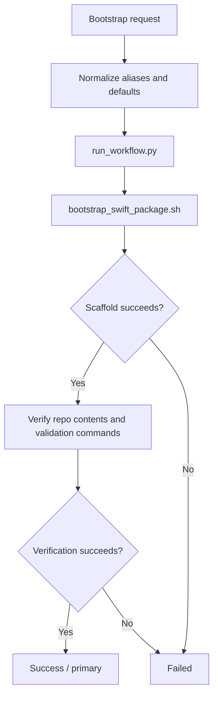

# Workflow Atlas

This document describes the maintainer-facing workflow view of the active skills in `apple-dev-skills`, including branches, guards, fallbacks, handoffs, input and output contracts, and the user-facing interface between the user, the agent, and each skill.

## Terminology

- `primary workflow`: the main numbered path for a skill
- `guard`: a condition that must be satisfied before the primary workflow continues
- `fallback`: a supported secondary path when the primary workflow cannot continue
- `handoff`: a transfer to another skill or later stage
- `blocked`: no valid path remains
- `status`: the terminal state reported by the skill
- `path_type`: whether the completed path was `primary` or `fallback`

## Repo Workflow Map

### Workflow Diagram

### Branch and Path Notes

- The repo has no Apple router or orchestrator layer.
- The three active skills are parallel top-level entry points for different situations.
- Cross-skill recommendation is decentralized inside each skill.
- End-user `AGENTS.md` guidance is recommended from each skill's local snippet copy, not from a router.

### Packaging and Delegation Notes

- The current shipped surface in this repository is a skill bundle, not a plugin marketplace.
- If this repository adds Codex plugin packaging later, treat that as a distribution wrapper around the existing skills, with optional bundled apps or MCP servers.
- If this repository adds Claude plugin packaging later, treat that as a distribution wrapper that may also carry plugin-scoped subagents or other Claude-specific integration files.
- Subagents in either ecosystem are runtime delegation helpers with separate context and tool policy. They are not the canonical authoring format for the repo's Apple workflows.
- Repo docs should keep the layers explicit:
  - `AGENTS.md` for durable policy
  - `skills/` for reusable workflow authoring
  - plugin files for installable distribution
  - subagent files for delegated runtime behavior

### Agent ↔ User UX

- Entry:
  - The user asks for Apple, Swift, Dash, or package-bootstrap help.
- Agent behavior:
  - The agent chooses the best matching top-level skill directly and may recommend another top-level skill if the task shifts.
- User-visible response:
  - The user sees direct progress inside one of the three top-level skills, or a direct recommendation to switch to another skill.
- Interaction style:
  - The repo-level UX is a bundle of three parallel top-level skills: one execution skill, one Dash management skill, and one new-package bootstrap skill.

## `apple-xcode-workflow`

### Purpose

Provide the canonical Apple and Swift workflow guidance with one local runtime-policy entrypoint and one agent-side execution path.

### Workflow Diagram

### Branch and Path Notes

- `run_workflow.py` is the local runtime entrypoint.
- Mutation is a guard, not a second top-level workflow.
- Docs lookup is an operation profile under the same execution engine.
- Official CLI execution remains the only documented fallback plan when the primary agent-side MCP path cannot complete.

### Inputs

- Required:
  - `operation_type`
- Optional:
  - `workspace_path`
  - `tab_identifier`
  - `mcp_failure_reason`
  - `docs_query`
- Defaults:
  - repo-maintainer runtime entrypoint `scripts/run_workflow.py`
  - one retry for transient MCP failure
  - advisory cooldown `21` days
  - docs source order `dash-mcp,dash-local,official-web`
  - mutation operations require the explicit guard in Xcode-managed scope

### Outputs

- `status`
  - `success`
  - `handoff`
  - `blocked`
- `path_type`
  - `primary`
  - `fallback`
- Primary output fields:
  - operation type
  - `guard_result`
  - `docs_route`
  - `fallback_commands`
  - next step or handoff payload

### Agent ↔ User UX

- Entry:
  - The user asks for Apple or Swift execution, diagnostics, docs, toolchain, or mutation work.
- Agent behavior:
  - The agent classifies the operation, runs `run_workflow.py` for local policy and fallback planning, then uses MCP tools or the planned fallback path.
- User-visible response:
  - On success: the user sees the completed path and what ran.
  - On fallback: the user sees that CLI was used and why.
  - On handoff: the user sees the next-step payload or supporting guidance.
  - On blocked: the user sees the exact reason the workflow could not continue.
- Interaction style:
  - Execution engine with guards and a single official fallback path.

### Failure / Fallback / Handoff States

- `success` + `primary`: agent-side MCP path completed
- `success` + `fallback`: official CLI fallback completed
- `handoff`: supporting context passed to a later step or another skill
- `blocked`: mutation guard failed, context missing, or safe fallback unavailable

## `apple-dash-docsets`

### Purpose

Manage Dash docsets through one runtime entrypoint and a straight internal stage flow.

### Workflow Diagram

### Branch and Path Notes

- `run_workflow.py` is the local runtime entrypoint for all stages.
- Default progression is `search -> install -> generate`.
- Direct entry to `install` or `generate` remains supported.
- `search` has a fallback ladder.
- `install` does not fall back to generation internally; it hands off forward.
- `generate` is terminal guidance and can itself fall back from automation to manual guidance.

### Inputs

- Required:
  - `query` for `search`
  - `docset_request` for `install` and `generate`
- Optional:
  - `stage`
  - `docset_identifiers`
  - `approval`
- Defaults:
  - repo-maintainer runtime entrypoint `scripts/run_workflow.py`
  - start at `search` when no stage is explicit
  - search order `mcp -> http -> url-service`
  - install source priority `built-in,user-contributed,cheatsheet`
  - default search result limit `20`
  - default search snippets `true`

### Outputs

- `status`
  - `success`
  - `handoff`
  - `blocked`
- `path_type`
  - `primary`
  - `fallback`
- Primary output fields:
  - `stage`
  - `access_path` or `source_path`
  - `matches`
  - install result or generation guidance
  - next step

### Agent ↔ User UX

- Entry:
  - The user asks to search Dash, install a missing docset, or get generation guidance.
- Agent behavior:
  - The agent selects a stage, calls `run_workflow.py`, and uses the structured stage result to choose the right Dash access path instead of stitching helper scripts together manually.
- User-visible response:
  - On success: the user sees what stage ran and what path completed it.
  - On handoff: the user sees the next stage and why it is needed.
  - On blocked: the user sees the missing approval, missing request, or exhausted access path.
- Interaction style:
  - Stage-based docs-management workflow with one forward handoff contract.

### Failure / Fallback / Handoff States

- `success` + `primary`: selected stage completed on its normal path
- `success` + `fallback`: selected stage completed on a documented fallback path
- `handoff`: supporting context passed to the next Dash stage
- `blocked`: no usable access path, missing approval, or missing stage input

## `apple-swift-package-bootstrap`

### Purpose

Create a new Swift package repository with one top-level entry point. `scripts/run_workflow.py` is the runtime wrapper, and `scripts/bootstrap_swift_package.sh` remains the implementation core for scaffold creation and validation.

### Workflow Diagram

### Branch and Path Notes

- `run_workflow.py` is the documented runtime entrypoint.
- `scripts/bootstrap_swift_package.sh` remains the preferred scaffold path.
- Manual `swift package init` guidance is a narrow fallback, not a peer primary workflow.
- Successful scaffolds should hand off later execution work to `apple-xcode-workflow`.

### Inputs

- Required:
  - `name`
- Optional:
  - `type`
  - `destination`
  - `platform`
  - `version_profile`
  - `skip_validation`
  - `dry_run`
- Defaults:
  - repo-maintainer runtime entrypoint `scripts/run_workflow.py`
  - `type=library`
  - `destination=.`
  - `platform=multiplatform`
  - `version_profile=current-minus-one`
  - validation runs unless `--skip-validation` is passed

### Outputs

- `status`
  - `success`
  - `blocked`
  - `failed`
- `path_type`
  - `primary`
  - `fallback`
- Primary output fields:
  - resolved package path
  - normalized inputs
  - validation result
  - next step

### Agent ↔ User UX

- Entry:
  - The user asks to create a new Swift package repo or customize bootstrap defaults.
- Agent behavior:
  - The agent resolves defaults through `run_workflow.py`, lets the wrapper invoke the bundled script, and reports the normalized result.
- User-visible response:
  - On success: the user sees the created path, normalized options, and validation result.
  - On fallback: the user sees the manual bootstrap path and why the bundled path was unavailable.
  - On blocked: the user sees the missing prerequisite or unsafe target-directory condition.
- Interaction style:
  - Deterministic scaffolding workflow with one preferred script path and one manual fallback.

### Failure / Fallback / Handoff States

- `success` + `primary`: bundled scaffold path completed successfully
- `success` + `fallback`: manual scaffold guidance is being used instead of the script
- `failed`: the bundled script started but did not complete
- `blocked`: prerequisites or target-directory rules prevented the run
