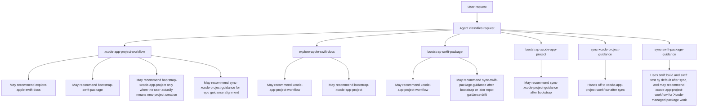
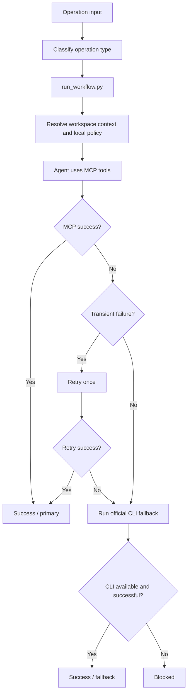
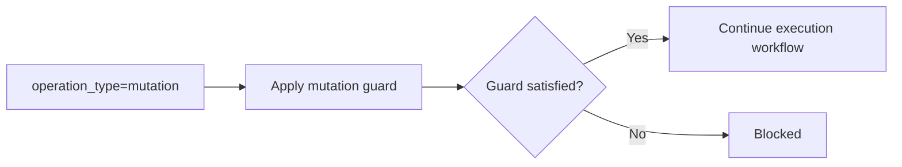
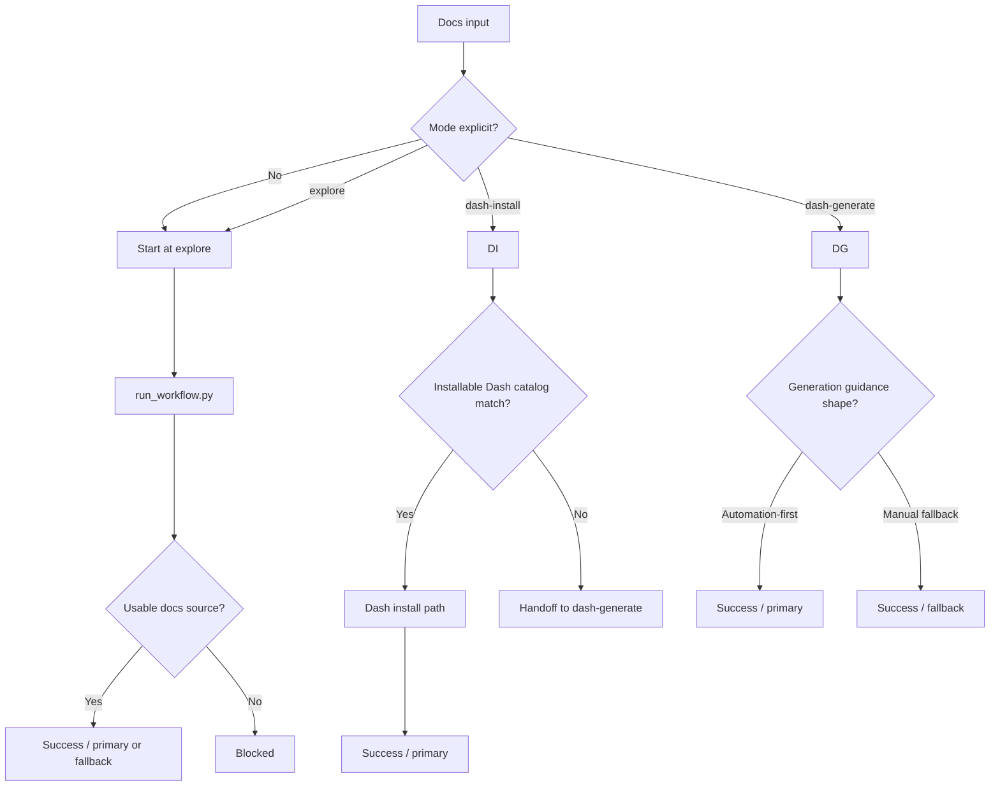
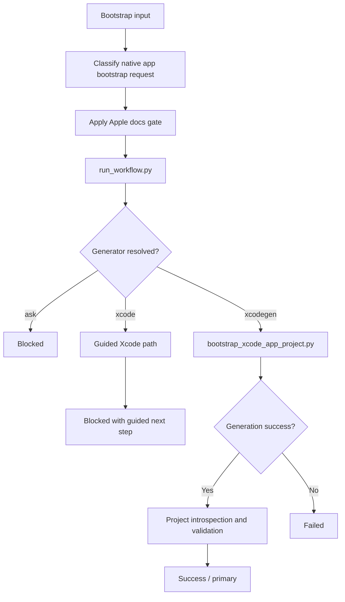
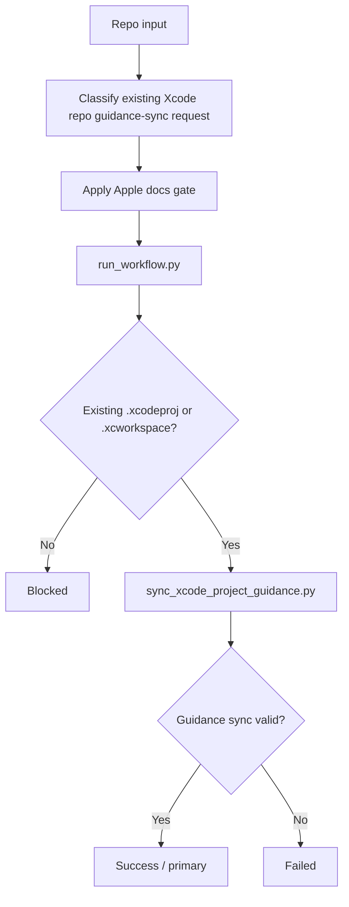
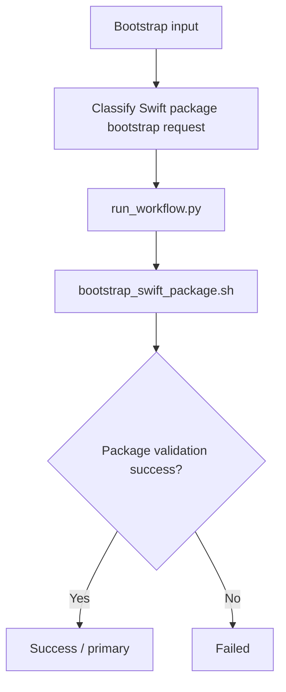
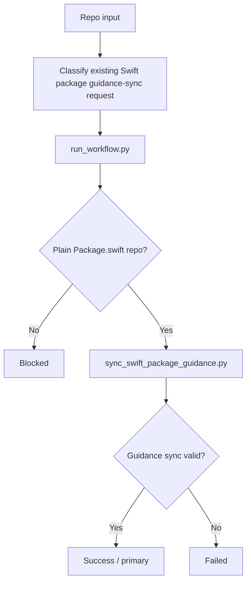

# Workflow Atlas

This document describes the maintainer-facing workflow view of the active skills in `apple-dev-skills`, including branches, guards, fallbacks, handoffs, input and output contracts, and the user-facing interface between the user, the agent, and each skill.

## Terminology

- `primary workflow`: the main numbered path for a skill
- `guard`: a condition that must be satisfied before the primary workflow continues
- `fallback`: a supported secondary path when the primary workflow cannot continue
- `handoff`: a transfer to another skill or later stage
- `blocked`: no valid path remains
- `status`: the terminal state reported by the skill
- `path_type`: whether the completed path was `primary` or `fallback`

## Repo Workflow Map

### Workflow Diagram

### Branch and Path Notes

- The repo has no Apple router or orchestrator layer.
- The six active skills are parallel top-level entry points for different situations.
- Cross-skill recommendation is decentralized inside each active skill.
- End-user `AGENTS.md` guidance is recommended from each skill's local snippet copy, not from a router.
- The active skill surface now uses the intended install-facing names directly.

### Packaging and Delegation Notes

- The repository is moving to a plugin-first install model while keeping root `skills/` as the authoring source of truth.
- The Codex-documented common denominator is:
  - `.codex-plugin/plugin.json`
  - `skills/`
  - optional `.app.json`
  - optional `.mcp.json`
  - optional `assets/`
- Claude Code supports a broader plugin surface and may also carry:
  - `hooks/`
  - `bin/`
  - `settings.json`
  - plugin-scoped subagents or other Claude-specific integration files
- Shared workflow behavior should remain skill-scoped so both ecosystems can use the same deterministic scripts and references.
- Claude-only extras should remain optional convenience layers rather than canonical workflow requirements.
- For local Codex plugin verification, the supported maintainer path is to install `plugins/apple-dev-skills/` through the official marketplace-based plugin flow. Gale-local helpers may exist as convenience shortcuts, but they are not the canonical repository contract.
- Subagents in either ecosystem are runtime delegation helpers with separate context and tool policy. They are not the canonical authoring format for the repo's Apple workflows.
- Repo docs should keep the layers explicit:
  - `AGENTS.md` for durable policy
  - `skills/` for reusable workflow authoring
  - plugin files for installable distribution
  - subagent files for delegated runtime behavior

### Agent ↔ User UX

- Entry:
  - The user asks for Apple, Swift, package-bootstrap, native app-bootstrap, or Apple-docs help.
- Agent behavior:
  - The agent chooses the best matching top-level skill directly and may recommend another top-level skill if the task shifts.
- User-visible response:
  - The user sees direct progress inside one of the six top-level skills, or a direct recommendation to switch to another skill.
- Interaction style:
  - The repo-level UX is a bundle of six parallel top-level skills, with plugin packaging layered around them as the install surface.

## `xcode-app-project-workflow`

### Purpose

Provide the canonical Apple and Swift execution workflow for existing Xcode-managed or Xcode-adjacent work, with one local runtime-policy entrypoint and one agent-side execution path.

### Workflow Diagram

### Branch and Path Notes

- `run_workflow.py` is the local runtime entrypoint.
- Mutation is a guard, not a second top-level workflow.
- Apple or Swift docs exploration now lives outside this skill in `explore-apple-swift-docs`.
- Official CLI execution remains the only documented fallback plan when the primary agent-side MCP path cannot complete.

### Inputs

- Required:
  - `operation_type`
- Optional:
  - `workspace_path`
  - `tab_identifier`
  - `mcp_failure_reason`
  - `filesystem_fallback_opt_in`
- Defaults:
  - repo-maintainer runtime entrypoint `scripts/run_workflow.py`
  - one retry for transient MCP failure
  - advisory cooldown `21` days
  - mutation operations require the explicit guard in Xcode-managed scope

### Outputs

- `status`
  - `success`
  - `handoff`
  - `blocked`
- `path_type`
  - `primary`
  - `fallback`
- Primary output fields:
  - operation type
  - `guard_result`
  - `fallback_commands`
  - next step or handoff payload

### Agent ↔ User UX

- Entry:
  - The user asks for Apple or Swift execution, diagnostics, toolchain, or mutation work.
- Agent behavior:
  - The agent classifies the operation, runs `run_workflow.py` for local policy and fallback planning, then uses MCP tools or the planned fallback path.
- User-visible response:
  - On success: the user sees the completed path and what ran.
  - On fallback: the user sees that CLI was used and why.
  - On handoff: the user sees the next-step payload or supporting guidance.
  - On blocked: the user sees the exact reason the workflow could not continue.
- Interaction style:
  - Execution engine with guards and a single official fallback path.

### Failure / Fallback / Handoff States

- `success` + `primary`: agent-side MCP path completed
- `success` + `fallback`: official CLI fallback completed
- `handoff`: supporting context passed to a later step or another skill
- `blocked`: mutation guard failed, context missing, or safe fallback unavailable

## `explore-apple-swift-docs`

### Purpose

Provide the canonical Apple and Swift documentation exploration workflow across Xcode MCP docs, Dash, and official web docs, with optional Dash follow-up when local Dash coverage is desired.

### Workflow Diagram

### Branch and Path Notes

- `run_workflow.py` is the local runtime entrypoint for all docs modes.
- Default progression is `explore -> dash-install -> dash-generate`.
- Direct entry to `dash-install` or `dash-generate` remains supported.
- Xcode MCP docs are the default primary source when available.
- Dash remains optional and subordinate rather than the public identity of the skill.

### Inputs

- Required:
  - `query` for `explore`
  - `docset_request` for `dash-install` and `dash-generate`
- Optional:
  - `mode`
  - `docs_kind`
  - `preferred_source`
  - `mcp_failure_reason`
  - `approval`
- Defaults:
  - repo-maintainer runtime entrypoint `scripts/run_workflow.py`
  - start at `explore` when no mode is explicit
  - source order `xcode-mcp-docs,dash,official-web`
  - Dash install source priority `built-in,user-contributed,cheatsheet`
  - default search result limit `20`
  - default search snippets `true`

### Outputs

- `status`
  - `success`
  - `handoff`
  - `blocked`
- `path_type`
  - `primary`
  - `fallback`
- Primary output fields:
  - `mode`
  - `source_used`
  - `configured_order` or `source_path`

### Agent ↔ User UX

- Entry:
  - The user asks to search Apple or Swift docs, use local docs first, compare docs sources, or follow up on Dash-specific docs access.
- Agent behavior:
  - The agent selects a docs mode, calls `run_workflow.py`, and uses the structured result to choose the right docs source instead of stitching Xcode MCP, Dash, and web heuristics together manually.
- User-visible response:
  - On success: the user sees what docs source was selected and why.
  - On handoff: the user sees the next mode and why it is needed.
  - On blocked: the user sees the missing approval, missing request, or exhausted docs source path.
- Interaction style:
  - Single docs-exploration workflow with subordinate Dash follow-up.

### Failure / Fallback / Handoff States

- `success` + `primary`: selected mode completed on its normal path
- `success` + `fallback`: selected mode completed on a documented fallback path
- `handoff`: supporting context passed to the next docs mode
- `blocked`: no usable docs source, missing approval, or missing mode input

## `bootstrap-xcode-app-project`

### Purpose

Provide the canonical new native Apple app bootstrap workflow with one runtime-policy entrypoint and one currently supported mutating path.

### Workflow Diagram

### Branch and Path Notes

- `run_workflow.py` is the local runtime entrypoint.
- The first supported mutating implementation path is `xcodegen`.
- The standard Xcode-created-project path is documented and guided, but not yet safely automated.
- Successful bootstrap hands off existing-project work to `sync-xcode-project-guidance`, then to `xcode-app-project-workflow`.

### Inputs

- Required:
  - `name`
- Optional:
  - `destination`
  - `project_kind`
  - `platform`
  - `ui_stack`
  - `project_generator`
  - `bundle_identifier`
  - `org_identifier`
  - `skip_validation`
  - `dry_run`

### Outputs

- `status`
  - `success`
  - `blocked`
  - `failed`
- `path_type`
  - `primary`
  - `fallback`

### Agent ↔ User UX

- Entry:
  - The user asks to start or bootstrap a new native Apple app.
- Agent behavior:
  - The agent applies the Apple docs gate, resolves the generator path, then either runs the supported XcodeGen scaffold path or returns the documented guided Xcode next step.
- User-visible response:
  - On success: the user sees the created repo path and handoff to guidance sync.
  - On blocked: the user sees whether the blocker was generator selection, missing prerequisites, or a guided-only path.
  - On failed: the user sees the concrete generation or validation failure.

### Failure / Fallback / Handoff States

- `success` + `primary`: the XcodeGen-backed bootstrap path completed

## `sync-xcode-project-guidance`

### Purpose

Provide the canonical existing-repo guidance-sync workflow for Xcode app repositories so `xcode-app-project-workflow` can stay focused on execution.

### Workflow Diagram

### Branch and Path Notes

- The skill is intentionally bounded to repo-guidance alignment for existing Xcode app repos.
- New-project creation belongs to `bootstrap-xcode-app-project`.
- Active engineering work after sync belongs to `xcode-app-project-workflow`.

### Agent ↔ User UX

- Entry:
  - The user asks to align or add repo guidance in an existing Xcode app repo.
- Agent behavior:
  - The agent verifies the repo shape, applies the guidance sync script, then hands execution work back to `xcode-app-project-workflow`.
- User-visible response:
  - On success: the user sees that repo guidance is aligned and what to use next.
  - On blocked: the user sees the exact repo-shape blocker.

### Failure / Fallback / Handoff States

- `success` + `primary`: repo guidance sync completed

## `bootstrap-swift-package`

### Purpose

Provide the canonical new Swift package bootstrap workflow with one runtime-policy entrypoint and one deterministic scaffold path.

### Workflow Diagram

### Branch and Path Notes

- This skill is bounded to plain Swift package creation.
- Within the supported `Swift 5.10+` floor, it prefers current `swift package init` testing-selection flags and only relies on the older default XCTest template when `xctest` is requested and the local CLI exposes no testing-selection flags at all.
- Existing-package guidance sync belongs to `sync-swift-package-guidance`.
- Xcode-specific execution after bootstrap may belong to `xcode-app-project-workflow`.

### Agent ↔ User UX

- Entry:
  - The user asks to create a new Swift package.
- Agent behavior:
  - The agent resolves package defaults, runs the deterministic bootstrap path, then hands later guidance-drift work to the sync skill when needed.
- User-visible response:
  - On success: the user sees the created package path and baseline validation.
  - On failed: the user sees the exact scaffold or validation blocker.

### Failure / Fallback / Handoff States

- `success` + `primary`: package bootstrap completed

## `sync-swift-package-guidance`

### Purpose

Provide the canonical existing-repo guidance-sync workflow for plain Swift packages so package bootstrap and Xcode execution can stay focused.

### Workflow Diagram

### Branch and Path Notes

- This skill is intentionally bounded to repo-guidance alignment for plain Swift packages.
- New-package creation still belongs to `bootstrap-swift-package`.
- Xcode-managed package execution may still belong to `xcode-app-project-workflow`.

### Agent ↔ User UX

- Entry:
  - The user asks to align or add repo guidance in an existing Swift package repo.
- Agent behavior:
  - The agent verifies the repo shape, applies the guidance sync script, then hands ordinary package work back to `swift build`, `swift test`, or `xcode-app-project-workflow` when Xcode-managed behavior matters.
- User-visible response:
  - On success: the user sees that repo guidance is aligned and what to use next.
  - On blocked: the user sees the exact repo-shape blocker.

### Failure / Fallback / Handoff States

- `success` + `primary`: repo guidance sync completed
