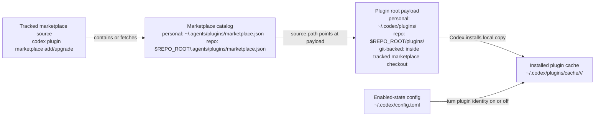

# Codex Plugin Install Surfaces

Use this document when maintainers need a durable map of how Codex's documented plugin surfaces fit together.

This is not a replacement for the official docs. It is a maintainer-focused translation layer for the parts that are easiest to blur together during local plugin work.

## Plugin Root Structure

OpenAI's current plugin docs separate the plugin root from the marketplace source, marketplace catalog, and config surfaces:

- every plugin has a manifest at `.codex-plugin/plugin.json`
- only `plugin.json` belongs in `.codex-plugin/`
- `skills/`, `.app.json`, `.mcp.json`, and `assets/` belong at the plugin root
- plugin manifests point to bundled skill folders with a root-relative `"skills": "./skills/"` field
- marketplace `source.path` should point at the plugin root directory, not at `.codex-plugin/`

## Core Model

Codex plugin wiring has five different jobs on five different surfaces:

1. Tracked marketplace source
   - Purpose: tell Codex where to fetch and refresh the marketplace from.
   - Preferred user command: `codex plugin marketplace add <owner>/<repo>`
   - Update command: `codex plugin marketplace upgrade <marketplace-name>`
   - Common `socket` command: `codex plugin marketplace add gaelic-ghost/socket`
2. Marketplace catalog
   - Purpose: tell Codex which plugins are discoverable from a given marketplace.
   - Personal path: `~/.agents/plugins/marketplace.json`
   - Repo path: `$REPO_ROOT/.agents/plugins/marketplace.json`
3. Plugin root payload
   - Purpose: hold the plugin root payload on disk that a marketplace entry points at.
   - Common personal pattern: `~/.codex/plugins/<plugin-name>`
   - Common repo pattern from the docs: `$REPO_ROOT/plugins/<plugin-name>`
   - Git-backed marketplace pattern: a plugin root inside Codex's tracked marketplace checkout.
   - Standalone plugin repos usually point at `./`; `socket` points at child plugin roots such as `./plugins/agent-plugin-skills`.
4. Installed plugin cache
   - Purpose: hold Codex's installed runtime copy.
   - Path: `~/.codex/plugins/cache/$MARKETPLACE_NAME/$PLUGIN_NAME/$VERSION/`
   - For local plugins, the documented version token is `local`.
5. Enabled-state config
   - Purpose: say whether a marketplace-scoped plugin is enabled or disabled.
   - Documented plugin path: `~/.codex/config.toml`

## Diagram



## What Each Surface Is Not

- A marketplace file is not the plugin payload.
- A marketplace file is not the enable or disable switch.
- A tracked marketplace source is not the enabled-state config.
- A plugin root payload is not the marketplace catalog.
- The installed cache is not usually the place you edit directly.
- `config.toml` is not the install destination.

## Preferred User Install And Update Path

Use the official Git-backed marketplace commands for ordinary user installation and updates. This lets Codex track the marketplace source and refresh it without asking users to copy plugin directories by hand.

For `socket`, use the superproject marketplace:

```bash
codex plugin marketplace add gaelic-ghost/socket
codex plugin marketplace upgrade socket
```

For a standalone plugin repository that carries its own `.agents/plugins/marketplace.json`, use that repository directly:

```bash
codex plugin marketplace add gaelic-ghost/apple-dev-skills
codex plugin marketplace add gaelic-ghost/SpeakSwiftlyServer
```

After the marketplace is added or upgraded, restart Codex, open the plugin directory in the Codex GUI, choose the marketplace, and install or enable the desired plugin there. Use explicit refs such as `gaelic-ghost/socket@vX.Y.Z` only for pinned reproducible installs. Manual local marketplace files and copied payload directories are development and fallback tools, not the preferred user path.

## Marketplace Identity

Codex tracks plugin enabled-state by plugin name plus marketplace name.

Example:

```toml
[plugins."agent-plugin-skills@socket"]
enabled = true
```

That means:

- `agent-plugin-skills` is the plugin name
- `socket` is the marketplace name
- the config entry is about that exact plugin identity from that exact marketplace

If you later rename the marketplace or switch the plugin to a different marketplace, the config identity changes too.

## General Config Note

The broader Codex config reference also says Codex can load trusted project-scoped overrides from `.codex/config.toml`.

Keep that separate from the plugin install-surface map:

- the current plugin docs explicitly describe plugin on or off state in `~/.codex/config.toml`
- the plugin docs do not describe repo-local plugin enabled-state as its own install-surface category
- if you mention project-scoped `.codex/config.toml`, label it as a general Codex config capability rather than part of the documented plugin wiring model

## Personal Scope

Personal scope means the catalog and enablement live in your home-directory Codex surfaces.

- Catalog: `~/.agents/plugins/marketplace.json`
- Common copied payload path: `~/.codex/plugins/<plugin-name>`
- Runtime cache: `~/.codex/plugins/cache/...`
- Enabled-state: `~/.codex/config.toml`

This is the clearest fit for unpublished local development or personal-only experiments. For published plugins and curated catalogs, prefer a Git-backed marketplace source so update instructions can use `codex plugin marketplace upgrade`.

## Repo Scope

Repo scope means the catalog is attached to one repository.

- Catalog: `$REPO_ROOT/.agents/plugins/marketplace.json`
- Common plugin root payload path from the docs: `$REPO_ROOT/plugins/<plugin-name>`
- Documented plugin enabled-state path: `~/.codex/config.toml`

Important nuance:

- The repo marketplace is still a catalog, not a private install vault.
- If the repo tracks that marketplace in git, it is advertising those plugins as part of the repo-visible Codex surface.
- When that repository is added with `codex plugin marketplace add`, Codex can track and update the repo marketplace as a Git-backed marketplace source.
- OpenAI's documented Codex plugin model exposes repo-visible plugins through marketplace catalogs and does not describe a richer repo-private scoping model beyond that visible marketplace model.

## Practical Reading Order

When a plugin looks wrong, inspect in this order:

1. tracked marketplace source
   - Was it added with `codex plugin marketplace add`?
   - Does `codex plugin marketplace upgrade <marketplace-name>` refresh it cleanly?
2. marketplace entry
   - Is the plugin listed in the expected marketplace?
   - Does `source.path` point at the intended plugin root payload directory?
3. plugin root payload
   - Does the target directory exist?
   - Does it contain `.codex-plugin/plugin.json` and the expected plugin-root surfaces such as `skills/`?
4. enabled-state
   - Is the plugin identity enabled in `config.toml`?
   - Is there a stale identity from an older marketplace name or scope?
5. installed cache
   - If Codex still behaves like an old version is installed, restart Codex and confirm the cache/install state refreshed.

## Common Failure Modes

- stale marketplace identity in `config.toml`
  - Example: `my-plugin@local-repo` remains enabled after the repo-local marketplace is gone.
- marketplace points at the wrong plugin root payload path
  - The plugin appears in the catalog, but Codex is reading the wrong files.
- copied payload drift
  - The repo source changed, but the local copied plugin root the marketplace points at was not updated. Prefer Git-backed marketplace sources so this becomes `codex plugin marketplace upgrade <marketplace-name>`.
- confusion between discovery mirrors and plugin packaging
  - A repo-local `.agents/skills` symlink mirror is not the same thing as a packaged plugin root.

## This Repository's Position

This repository is intentionally source-first.

- Root `skills/` is canonical.
- Root `.codex-plugin/plugin.json` is the packaged plugin manifest for this source repo.
- The manifest declares `"skills": "./skills/"` so Codex knows this plugin bundles the authored skill surface.
- `.agents/skills` and `.claude/skills` are local authoring mirrors.
- This repository does not track a nested repo-local Codex plugin install surface for itself.
- This repository does not track a repo-local marketplace file for itself.
- User installs should normally come through the Git-backed `socket` marketplace with `codex plugin marketplace add gaelic-ghost/socket`.

That means repo-local discovery mirrors in this repository should not be described as packaged plugin install roots.

## Official References

- [OpenAI Codex plugin build docs](https://developers.openai.com/codex/plugins/build)
- [How Codex uses marketplaces](https://developers.openai.com/codex/plugins/build#how-codex-uses-marketplaces)
- [Add a marketplace from the CLI](https://developers.openai.com/codex/plugins/build#add-a-marketplace-from-the-cli)
- [Install a local plugin manually](https://developers.openai.com/codex/plugins/build#install-a-local-plugin-manually)
- [Marketplace metadata](https://developers.openai.com/codex/plugins/build#marketplace-metadata)
- [Remove or turn off a plugin](https://developers.openai.com/codex/plugins#remove-or-turn-off-a-plugin)
