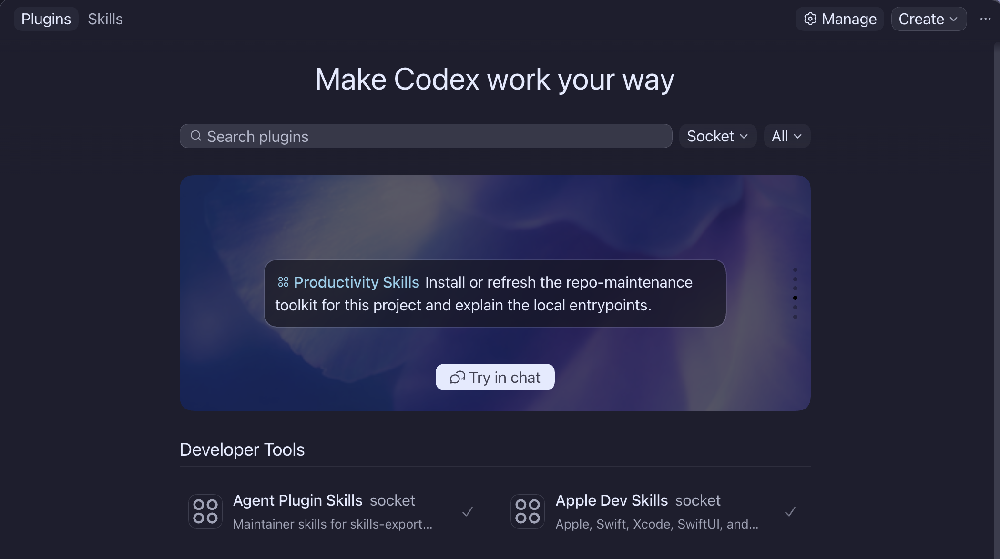

# apple-dev-skills

Apple, Swift, SwiftUI, Xcode, and DocC workflow skills for Codex.



The Socket marketplace is the easiest way to install Apple Dev Skills alongside the companion Productivity Skills workflows that Apple bootstrap and guidance-sync skills can use.

## Table of Contents

- [Overview](#overview)
- [Quick Start](#quick-start)
- [Usage](#usage)
- [Development](#development)
- [Repo Structure](#repo-structure)
- [Active Skills](#active-skills)
- [Release Notes](#release-notes)
- [License](#license)

## Overview

### Status

`apple-dev-skills` is active and usable as a Codex plugin.

### What This Project Is

This repository is the canonical source of truth for Gale's Apple, Swift, and Xcode workflow skills. It gives agents focused workflows for reading Apple docs first, working with Swift and SwiftUI, using Xcode safely, building and testing Swift packages or Xcode projects, writing DocC, and keeping Apple repo guidance aligned.

### Motivation

Apple development work has sharp edges around framework behavior, Xcode project state, documentation, accessibility, and build tooling. This plugin keeps those rules in one place so agents can move carefully without turning every Swift or Xcode task into guesswork.

## Quick Start

The easiest way to install Apple Dev Skills with its companion workflows is through Gale's Socket marketplace:

```bash
codex plugin marketplace add gaelic-ghost/socket
```

When the Socket marketplace changes, refresh it:

```bash
codex plugin marketplace upgrade socket
```

Restart Codex, open the plugin directory, choose `Socket`, and install or enable `apple-dev-skills`. Install `productivity-skills` from the same marketplace too if you want the Apple bootstrap and guidance-sync workflows.

## Usage

Use Apple Dev Skills when an agent is helping with:

- Swift and SwiftUI implementation
- Xcode build, run, test, and project workflows
- Swift package bootstrap, build, and testing
- Apple UI accessibility work
- DocC comments, articles, and documentation catalogs
- Swift source formatting and file organization
- Apple docs lookup before design or code changes
- Apple-specific repo guidance setup or refresh

Most Apple Dev Skills workflows are useful as a standalone plugin. Bootstrap and guidance-sync workflows also need `productivity-skills`, because that companion plugin owns the reusable repo-maintenance workflow that Apple Dev Skills applies to Swift packages and Xcode apps.

Treat `productivity-skills` as the default baseline layer for general repo-doc and maintenance work, and use Apple Dev Skills when Apple-specific behavior should shape the workflow.

The [`socket`](https://github.com/gaelic-ghost/socket) repository is Gale's plugin superproject and marketplace catalog.

If you only want the Apple plugin without the rest of Socket, the standalone marketplace remains supported:

```bash
codex plugin marketplace add gaelic-ghost/apple-dev-skills
codex plugin marketplace upgrade apple-dev-skills
```

When installed as a Codex plugin, Apple Dev Skills also registers Xcode's built-in MCP bridge through `xcrun mcpbridge`. Users still need to allow external agents in Xcode's Intelligence settings and keep the relevant project open in Xcode before external Codex sessions can use Xcode-provided tools.

## Development

Treat root [`skills/`](./skills/) as the canonical authored surface. Keep shared reusable assets in [`shared/`](./shared/) and tests in [`tests/`](./tests/).

Use [`CONTRIBUTING.md`](./CONTRIBUTING.md) for maintainer workflow details, and use [AGENTS.md](./AGENTS.md) for agent-facing repo rules.

Run the repository test suite for skill and metadata changes:

```bash
bash .github/scripts/validate_repo_docs.sh
uv run pytest
```

## Repo Structure

```text
.
├── .codex-plugin/
├── .mcp.json
├── docs/
├── shared/
├── skills/
├── tests/
├── AGENTS.md
├── CONTRIBUTING.md
├── README.md
└── ROADMAP.md
```

## Active Skills

- `apple-ui-accessibility-workflow`
- `author-swift-docc-docs`
- `bootstrap-swift-package`
- `bootstrap-xcode-app-project`
- `explore-apple-swift-docs`
- `format-swift-sources`
- `structure-swift-sources`
- `swift-package-build-run-workflow`
- `swift-package-testing-workflow`
- `swift-package-workflow`
- `swiftui-app-architecture-workflow`
- `sync-swift-package-guidance`
- `sync-xcode-project-guidance`
- `xcode-app-project-workflow`
- `xcode-build-run-workflow`
- `xcode-testing-workflow`

## Release Notes

Use GitHub releases and Git history to track shipped changes for this repository.

## License

This repository is licensed under Apache 2.0. See [LICENSE](./LICENSE).
