# Workflow Atlas

This document describes the maintainer-facing workflow view of the active skills in `apple-dev-skills`, including branches, guards, fallbacks, handoffs, input and output contracts, and the user-facing interface between the user, the agent, and each skill.

## Terminology

- `primary workflow`: the main numbered path for a skill
- `guard`: a condition that must be satisfied before the primary workflow continues
- `fallback`: a supported secondary path when the primary workflow cannot continue
- `handoff`: a transfer to another skill or later stage
- `blocked`: no valid path remains
- `status`: the terminal state reported by the skill
- `path_type`: whether the completed path was `primary` or `fallback`

## Repo Workflow Map

### Workflow Diagram

```mermaid
flowchart TD
    U["User request"] --> A["Agent classifies request"]
    A --> XBR["xcode-build-run-workflow"]
    A --> XT["xcode-testing-workflow"]
    A --> X["xcode-app-project-workflow (legacy compatibility)"]
    A --> WPBR["swift-package-build-run-workflow"]
    A --> WPT["swift-package-testing-workflow"]
    A --> WP["swift-package-workflow (legacy compatibility)"]
    A --> DOCC["author-swift-docc-docs"]
    A --> D["explore-apple-swift-docs"]
    A --> ST["format-swift-sources"]
    A --> SS["structure-swift-sources"]
    A --> B["bootstrap-swift-package"]
    A --> AX["bootstrap-xcode-app-project"]
    A --> SX["sync-xcode-project-guidance"]
    A --> SP["sync-swift-package-guidance"]
    X --> XD["May recommend explore-apple-swift-docs"]
    X --> XF["May recommend format-swift-sources for SwiftLint or SwiftFormat setup"]
    X --> XSRC["May recommend structure-swift-sources for source cleanup"]
    X --> XWP["May recommend swift-package-build-run-workflow or swift-package-testing-workflow for ordinary package work"]
    X --> XNEW["May recommend bootstrap-xcode-app-project only when the user actually means new-project creation"]
    X --> SG["May recommend sync-xcode-project-guidance for repo guidance alignment"]
    WPBR --> WPBRD["May recommend explore-apple-swift-docs"]
    WPBR --> WPBRT["May recommend swift-package-testing-workflow for test-focused work"]
    WPBR --> WPBRX["May recommend xcode-build-run-workflow when Xcode-managed behavior matters"]
    WPT --> WPTD["May recommend explore-apple-swift-docs"]
    WPT --> WPTB["May recommend swift-package-build-run-workflow for build or manifest work"]
    WPT --> WPTX["May recommend xcode-testing-workflow or xcode-build-run-workflow when Xcode-managed behavior matters"]
    WP --> WPD["May recommend explore-apple-swift-docs"]
    WP --> WPR["Routes broad package work into the narrower package skills"]
    WP --> WPX["May recommend xcode-build-run-workflow or xcode-testing-workflow when Xcode-managed behavior matters"]
    WP --> WPS["May recommend sync-swift-package-guidance for repo guidance alignment"]
    DOCC --> DOCCD["May recommend explore-apple-swift-docs"]
    DOCC --> DOCCX["May recommend swift-package-build-run-workflow or xcode-build-run-workflow for generation, export, or hosting follow-through"]
    D --> DX["May recommend xcode-build-run-workflow or xcode-testing-workflow"]
    D --> DT["May recommend format-swift-sources when docs work turns into style-tooling setup"]
    ST --> SXD["May recommend xcode-build-run-workflow or xcode-testing-workflow when setup becomes active Xcode work"]
    ST --> STB["May recommend bootstrap skills when the user actually needs a full project scaffold"]
    ST --> STS["May recommend structure-swift-sources when the task becomes source cleanup"]
    SS --> SSF["Uses format-swift-sources before and after structure work"]
    SS --> SSX["May recommend xcode-build-run-workflow when file moves need guarded Xcode follow-through"]
    D --> DB["May recommend bootstrap-xcode-app-project"]
    B --> BW["May recommend swift-package-build-run-workflow or swift-package-testing-workflow"]
    B --> BX["May recommend xcode-build-run-workflow or xcode-testing-workflow"]
    B --> BS["May recommend sync-swift-package-guidance after bootstrap or later repo-guidance drift"]
    B --> BR["Installs repo-maintenance toolkit into the new repo"]
    AX --> AS["May recommend sync-xcode-project-guidance after bootstrap"]
    AX --> AR["Installs repo-maintenance toolkit into the new repo"]
    SX --> SXW["Hands off to xcode-build-run-workflow or xcode-testing-workflow after sync"]
    SX --> SR["Refreshes repo-maintenance toolkit while syncing guidance"]
    SP --> SPB["Uses the narrower package build-run or testing skills after sync, and may recommend the narrower Xcode skills for Xcode-managed package work"]
    SP --> SPR["Refreshes repo-maintenance toolkit while syncing guidance"]
```

### Branch and Path Notes

- The repo has no Apple router or orchestrator layer.
- The active surface now has fourteen skills, including four primary execution skills, one DocC authoring-and-review skill, and two legacy compatibility-routing execution surfaces.
- Cross-skill recommendation is decentralized inside each active skill.
- End-user `AGENTS.md` guidance is recommended from each skill's local snippet copy, not from a router.
- The active skill surface now uses the intended install-facing names directly.
- The shared repo-maintenance toolkit now lives inside the active Apple skill surface under `shared/repo-maintenance-toolkit/` so bootstrap and sync skills can keep installing the same managed file set without a second plugin or repo.
- The canonical shipped toolkit contract now lives in this repository, stays profile-aware, and gives downstream repos `scripts/repo-maintenance/config/profile.env` while Apple workflows choose either the `swift-package` or `xcode-app` profile explicitly.
- The Swift package side of the execution split is now in place, with build-run and testing split into separate primary skills while `swift-package-workflow` remains only as a legacy compatibility-routing surface.
- The Xcode side of the execution split is now in place too, with `xcode-build-run-workflow` and `xcode-testing-workflow` as the real owners while `xcode-app-project-workflow` remains only as a legacy compatibility-routing surface.

## Planned Execution Split

- Planned replacement execution matrix:
  - `xcode-build-run-workflow`
  - `xcode-testing-workflow`
  - `swift-package-build-run-workflow`
  - `swift-package-testing-workflow`
- The Swift package side has started landing now:
  - `swift-package-build-run-workflow`
  - `swift-package-testing-workflow`
  - `swift-package-workflow` as a legacy compatibility surface
- The Xcode side has now landed:
  - `xcode-build-run-workflow`
  - `xcode-testing-workflow`
  - `xcode-app-project-workflow` as a legacy compatibility surface
- The split must preserve all current execution guidance, either directly in the narrower replacement skills, in shared references, or in synced and bootstrapped `AGENTS.md` output where the guidance is really durable repo policy.
- The active planning source for that work is `docs/maintainers/execution-split-and-inference-plan.md`.

### Packaging and Delegation Notes

- Treat `productivity-skills` as the baseline maintainer layer for general repo-doc and maintenance work.
- Use `apple-dev-skills` when Swift, Xcode, Apple docs requirements, or Apple-platform repo shape should materially change the workflow.
- The repository currently exports only from top-level `skills/`.
- If this repository later grows top-level `mcps/` or `apps/`, those directories are valid export surfaces too.
- The repository must not reintroduce a nested packaged plugin tree or any other second export surface under `plugins/`.
- Shared workflow behavior should remain skill-scoped so both ecosystems can use the same deterministic scripts and references.
- Claude-only extras should remain optional convenience layers rather than canonical workflow requirements.
- Subagents in either ecosystem are runtime delegation helpers with separate context and tool policy. They are not the canonical authoring format for the repo's Apple workflows.
- Repo docs should keep the layers explicit:
  - `AGENTS.md` for durable policy
  - `skills/` for reusable workflow authoring
  - subagent files for delegated runtime behavior

### Agent ↔ User UX

- Entry:
  - The user asks for Apple, Swift, package-bootstrap, native app-bootstrap, or Apple-docs help.
- Agent behavior:
  - The agent chooses the best matching top-level skill directly and may recommend another top-level skill if the task shifts.
- User-visible response:
  - The user sees direct progress inside one of the active top-level skills, or a direct recommendation to switch to another skill.
- Interaction style:
- The repo-level UX is a bundle of fourteen active skills exported from the top-level `skills/` surface.

## `xcode-build-run-workflow`

### Purpose

Provide the canonical execution workflow for existing Xcode-managed or Xcode-adjacent build, run, diagnostics, previews, toolchain, file-membership, and guarded mutation work.

### Branch and Path Notes

- `run_workflow.py` is the local runtime entrypoint.
- Test-focused requests hand off immediately to `xcode-testing-workflow`.
- Direct filesystem edits are allowed by default, but direct `.pbxproj` edits still trigger the explicit warning path.
- Official CLI execution remains the only documented fallback plan when the primary agent-side MCP path cannot complete.

### Agent ↔ User UX

- Entry:
  - The user asks for Xcode-aware build, run, diagnostics, previews, file-membership validation, toolchain work, or guarded mutation.
- Agent behavior:
  - The agent classifies the operation, runs `run_workflow.py` for local policy and fallback planning, then uses MCP tools or the planned fallback path.
- User-visible response:
  - On success: the user sees the completed path and what ran.
  - On handoff: the user sees that the request really belongs to `xcode-testing-workflow`.
  - On blocked: the user sees the exact `.pbxproj` or workspace-context blocker.

### Failure / Fallback / Handoff States

- `success` + `primary`: agent-side MCP path completed
- `success` + `fallback`: official CLI fallback completed
- `handoff`: the work belongs to `xcode-testing-workflow`
- `blocked`: direct `.pbxproj` warning boundary not yet satisfied, context missing, or safe fallback unavailable

## `xcode-testing-workflow`

### Purpose

Provide the canonical execution workflow for Xcode-native Swift Testing, XCTest, XCUITest, `.xctestplan`, filtering, retries, and test diagnosis.

### Branch and Path Notes

- `run_workflow.py` is the local runtime entrypoint.
- Build or run requests hand off immediately to `xcode-build-run-workflow`.
- Xcode-native test plans, destinations, and UI-test follow-through stay here.
- Direct `.pbxproj` edits still trigger the explicit warning path.

### Agent ↔ User UX

- Entry:
  - The user asks for Swift Testing, XCTest, XCUITest, `.xctestplan`, flaky-test diagnosis, test filtering, retries, or other test-focused Xcode work.
- Agent behavior:
  - The agent classifies the request, runs `run_workflow.py`, then stays on the Xcode-testing path or hands off cleanly when the request is really build-run or project-integrity work.
- User-visible response:
  - On success: the user sees the completed test path and what ran.
  - On handoff: the user sees that the request really belongs to `xcode-build-run-workflow`.
  - On blocked: the user sees the exact `.pbxproj` or workspace-context blocker.

### Failure / Fallback / Handoff States

- `success` + `primary`: agent-side MCP test path completed
- `success` + `fallback`: official CLI fallback completed
- `handoff`: the work belongs to `xcode-build-run-workflow`
- `blocked`: direct `.pbxproj` warning boundary not yet satisfied, context missing, or safe fallback unavailable

## `xcode-app-project-workflow`

### Purpose

Provide a compatibility-routing surface for older references to broad Xcode execution, while steering the request into `xcode-build-run-workflow` or `xcode-testing-workflow`.

### Workflow Diagram

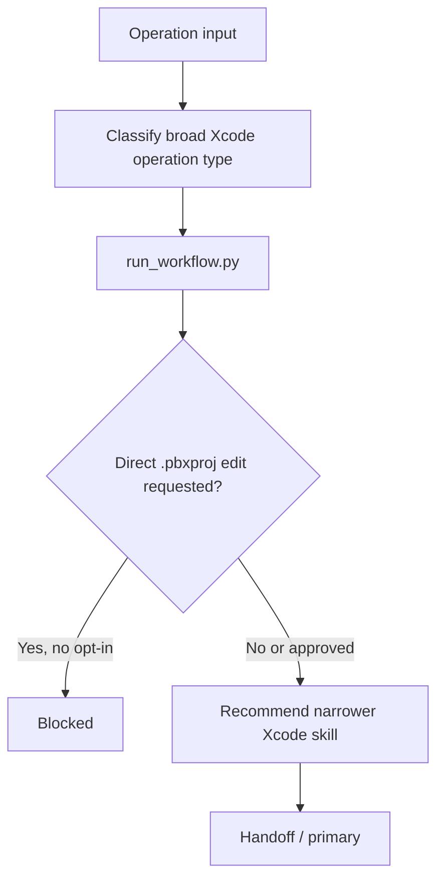

### Branch and Path Notes

- `run_workflow.py` is the local runtime entrypoint.
- The primary job is compatibility routing, not long-term ownership of Xcode execution guidance.
- It preserves the direct `.pbxproj` warning boundary while routing to the narrower Xcode skills.
- Apple or Swift docs exploration now lives outside this skill in `explore-apple-swift-docs`.
- Ordinary Swift package execution now lives outside this skill in `swift-package-build-run-workflow` and `swift-package-testing-workflow`, with `swift-package-workflow` kept only as a compatibility surface.

### Inputs

- Required:
  - `operation_type`
- Optional:
  - `workspace_path`
  - `tab_identifier`
  - `mcp_failure_reason`
  - `direct_pbxproj_edit`
  - `direct_pbxproj_edit_opt_in`
- Defaults:
  - repo-maintainer runtime entrypoint `scripts/run_workflow.py`
  - ordinary direct edits are allowed
  - direct `.pbxproj` edits require an explicit warning and opt-in

### Outputs

- `status`
  - `handoff`
  - `blocked`
- `path_type`
  - `primary`
- Primary output fields:
  - operation type
  - `guard_result`
  - `recommended_skill`
  - next step payload

### Agent ↔ User UX

- Entry:
  - The user or an older prompt still asks for `xcode-app-project-workflow`, or the request is broad enough that Xcode build/run versus Xcode testing still needs to be separated.
- Agent behavior:
  - The agent classifies the operation, runs `run_workflow.py` for compatibility routing and direct `.pbxproj` warning enforcement, then moves into the narrower Xcode skill.
- User-visible response:
  - On handoff: the user sees exactly why the work belongs in `xcode-build-run-workflow` or `xcode-testing-workflow`.
  - On blocked: the user sees the exact direct `.pbxproj` warning blocker.
- Interaction style:
  - Compatibility router with a narrow direct `.pbxproj` safety boundary.

### Failure / Fallback / Handoff States

- `handoff`: the work belongs to `xcode-build-run-workflow` or `xcode-testing-workflow`
- `blocked`: direct `.pbxproj` warning boundary not yet satisfied

## `swift-package-build-run-workflow`

### Purpose

Provide the canonical SwiftPM-first execution workflow for existing package repositories when the work is primarily about build, run, manifest, dependency, plugin, package-resource, Metal-distribution, or Release-versus-Debug concerns.

### Workflow Diagram

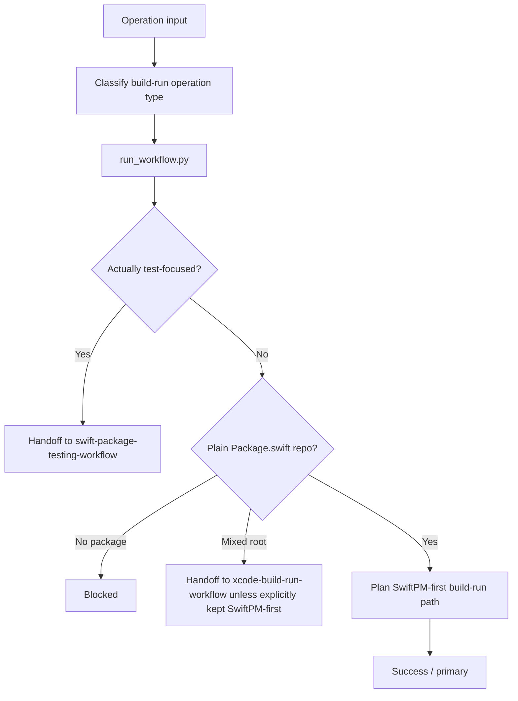

### Branch and Path Notes

- `run_workflow.py` is the local runtime entrypoint.
- SwiftPM and ordinary filesystem edits are the default execution surface.
- Test-focused requests hand off to `swift-package-testing-workflow`.
- Mixed roots hand off by default when Xcode-managed behavior may matter.

### Agent ↔ User UX

- Entry:
  - The user asks for manifest work, dependency changes, build, run, plugin work, package resources, Metal distribution, or Release-versus-Debug validation in a Swift package repo.
- Agent behavior:
  - The agent classifies the request, runs `run_workflow.py`, then stays on the SwiftPM-first build-run path or hands off cleanly when the request is really testing or Xcode-managed work.
- User-visible response:
  - On success: the user sees the planned or executed build-run path.
  - On handoff: the user sees whether the work belongs in `swift-package-testing-workflow` or `xcode-build-run-workflow`.
- Interaction style:
  - SwiftPM-first build-run engine with lightweight repo-shape safety.

### Failure / Fallback / Handoff States

- `success` + `primary`: SwiftPM-first build-run path completed
- `handoff`: the work belongs to `swift-package-testing-workflow` or `xcode-build-run-workflow`
- `blocked`: repo root missing, `Package.swift` missing, or no safe SwiftPM-first path exists

## `swift-package-testing-workflow`

### Purpose

Provide the canonical SwiftPM-first execution workflow for existing package repositories when the work is primarily about Swift Testing, XCTest holdouts, `.xctestplan`, fixtures, async test guidance, filtering, retries, or test diagnosis.

### Workflow Diagram

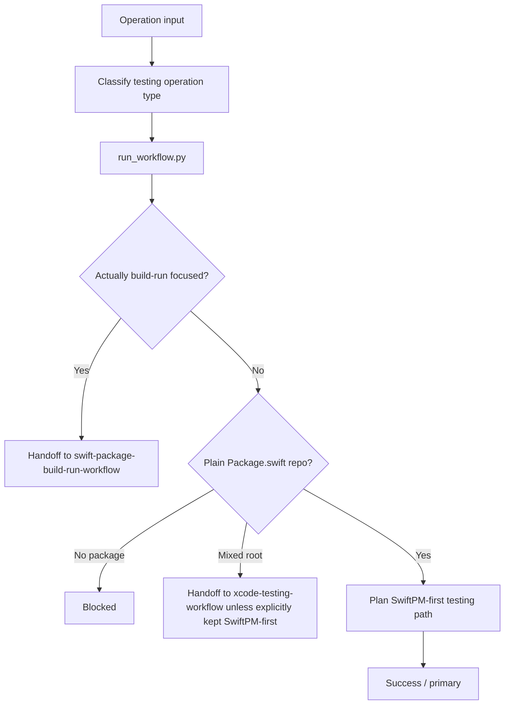

### Branch and Path Notes

- `run_workflow.py` is the local runtime entrypoint.
- SwiftPM and ordinary filesystem edits inside package-managed scope are the default execution surface.
- Build-run-focused requests hand off to `swift-package-build-run-workflow`.
- Mixed roots hand off by default when Xcode-managed behavior may matter.

### Agent ↔ User UX

- Entry:
  - The user asks for package tests, Swift Testing, XCTest, `.xctestplan`, flaky-test diagnosis, test fixtures, or test-only validation in a Swift package repo.
- Agent behavior:
  - The agent classifies the request, runs `run_workflow.py`, then stays on the package-testing path or hands off cleanly when the request is really build-run or Xcode-managed work.
- User-visible response:
  - On success: the user sees the planned or executed package-testing path.
  - On handoff: the user sees whether the work belongs in `swift-package-build-run-workflow`, `xcode-testing-workflow`, or `xcode-build-run-workflow`.
- Interaction style:
  - SwiftPM-first testing engine with lightweight repo-shape safety.

### Failure / Fallback / Handoff States

- `success` + `primary`: package-testing path completed
- `handoff`: the work belongs to `swift-package-build-run-workflow`, `xcode-testing-workflow`, or `xcode-build-run-workflow`
- `blocked`: repo root missing, `Package.swift` missing, or no safe package-testing path exists

## `swift-package-workflow`

### Purpose

Provide a compatibility-routing surface for older references to broad SwiftPM execution, while steering the request into `swift-package-build-run-workflow` or `swift-package-testing-workflow`.

### Workflow Diagram

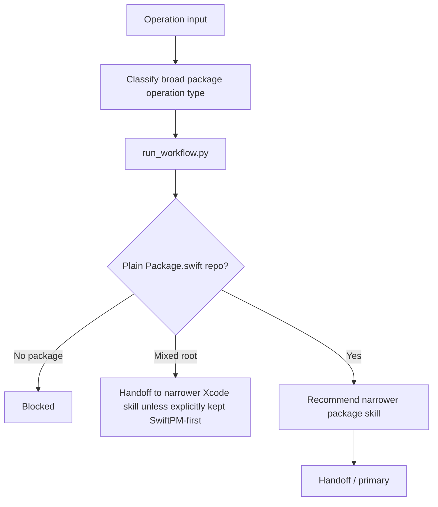

### Branch and Path Notes

- `run_workflow.py` is the local runtime entrypoint.
- The primary job is compatibility routing, not long-term ownership of package execution guidance.
- It preserves the mixed-root handoff to `xcode-build-run-workflow` or `xcode-testing-workflow`.
- Repo-guidance sync and new-package bootstrap remain outside this skill.

### Agent ↔ User UX

- Entry:
  - The user or an older prompt still asks for `swift-package-workflow`, or the request is broad enough that package build/run versus package testing still needs to be separated.
- Agent behavior:
  - The agent classifies the operation, runs `run_workflow.py` for repo-shape checks and compatibility routing, then moves into the narrower package skill or hands off when Xcode-managed behavior matters.
- User-visible response:
  - On handoff: the user sees exactly why the work belongs in `swift-package-build-run-workflow`, `swift-package-testing-workflow`, `xcode-build-run-workflow`, or `xcode-testing-workflow`.
  - On blocked: the user sees the exact repo-shape blocker.
- Interaction style:
  - Compatibility router with lightweight repo-shape safety.

### Failure / Fallback / Handoff States

- `handoff`: the work belongs to `swift-package-build-run-workflow`, `swift-package-testing-workflow`, `xcode-build-run-workflow`, or `xcode-testing-workflow`
- `blocked`: repo root missing, `Package.swift` missing, or no safe SwiftPM-first path exists

## `author-swift-docc-docs`

### Purpose

Provide the canonical DocC authoring-and-review workflow for Swift package and Xcode app or framework repositories.

### Branch and Path Notes

- `run_workflow.py` is the local runtime entrypoint.
- The skill owns symbol comments, articles, extension files, landing pages, topic groups, and the three-part correctness model for DocC work.
- Tutorial work is recognized, but the first release keeps tutorial handling intentionally light rather than claiming directive-deep expertise.
- Broad Apple-docs lookup hands off to `explore-apple-swift-docs`.
- Generation, export, archive, hosting, or project-integrity follow-through hands off to `swift-package-build-run-workflow` or `xcode-build-run-workflow`.

### Agent ↔ User UX

- Entry:
  - The user asks for DocC writing, DocC review, symbol-comment help, article help, extension-file help, landing-page organization, topic grouping, or DocC correctness review.
- Agent behavior:
  - The agent classifies repo shape and DocC task type, runs `run_workflow.py`, then either stays local to DocC authoring-and-review work or hands off when the request is really docs lookup or execution-heavy DocC follow-through.
- User-visible response:
  - On success: the user sees the resolved DocC task type, repo shape, correctness model, and next local DocC step.
  - On handoff: the user sees exactly why the request belongs in `explore-apple-swift-docs`, `swift-package-build-run-workflow`, or `xcode-build-run-workflow`.
  - On blocked: the user sees that the DocC task type or repo shape still needs to be made explicit.

### Failure / Fallback / Handoff States

- `success`: the request belongs to local DocC authoring-and-review work
- `handoff`: the request belongs to `explore-apple-swift-docs`, `swift-package-build-run-workflow`, or `xcode-build-run-workflow`
- `blocked`: the request lacks enough repo-shape or DocC-task detail to proceed honestly

## `explore-apple-swift-docs`

### Purpose

Provide the canonical Apple and Swift documentation exploration workflow across Xcode MCP docs, Dash, and official web docs, with optional Dash follow-up when local Dash coverage is desired.

### Workflow Diagram

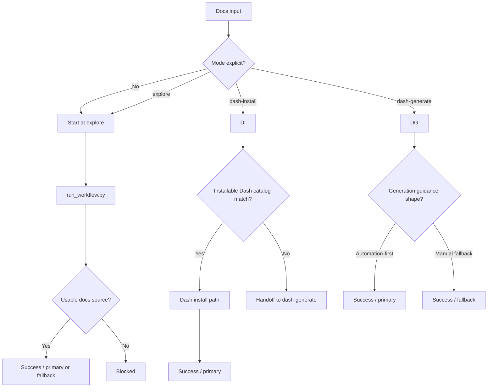

### Branch and Path Notes

- `run_workflow.py` is the local runtime entrypoint for all docs modes.
- Default progression is `explore -> dash-install -> dash-generate`.
- Direct entry to `dash-install` or `dash-generate` remains supported.
- Xcode MCP docs are the default primary source when available.
- Dash remains optional and subordinate rather than the public identity of the skill.

### Inputs

- Required:
  - `query` for `explore`
  - `docset_request` for `dash-install` and `dash-generate`
- Optional:
  - `mode`
  - `docs_kind`
  - `preferred_source`
  - `mcp_failure_reason`
  - `approval`
- Defaults:
  - repo-maintainer runtime entrypoint `scripts/run_workflow.py`
  - start at `explore` when no mode is explicit
  - source order `xcode-mcp-docs,dash,official-web`
  - Dash install source priority `built-in,user-contributed,cheatsheet`
  - default search result limit `20`
  - default search snippets `true`

### Outputs

- `status`
  - `success`
  - `handoff`
  - `blocked`
- `path_type`
  - `primary`
  - `fallback`
- Primary output fields:
  - `mode`
  - `source_used`
  - `configured_order` or `source_path`

### Agent ↔ User UX

- Entry:
  - The user asks to search Apple or Swift docs, use local docs first, compare docs sources, or follow up on Dash-specific docs access.
- Agent behavior:
  - The agent selects a docs mode, calls `run_workflow.py`, and uses the structured result to choose the right docs source instead of stitching Xcode MCP, Dash, and web heuristics together manually.
- User-visible response:
  - On success: the user sees what docs source was selected and why.
  - On handoff: the user sees the next mode and why it is needed.
  - On blocked: the user sees the missing approval, missing request, or exhausted docs source path.
- Interaction style:
  - Single docs-exploration workflow with subordinate Dash follow-up.

### Failure / Fallback / Handoff States

- `success` + `primary`: selected mode completed on its normal path
- `success` + `fallback`: selected mode completed on a documented fallback path
- `handoff`: supporting context passed to the next docs mode
- `blocked`: no usable docs source, missing approval, or missing mode input

## `format-swift-sources`

### Purpose

Provide the canonical SwiftLint and SwiftFormat integration workflow for Apple and Swift repositories, including surface selection, support-matrix enforcement, SwiftFormat-first ownership of formatting shape, SwiftLint-as-complement guidance for non-formatting signal, `.swift-version` guidance for version-sensitive SwiftFormat behavior, SwiftFormat config export from the Xcode host app or shared defaults state, and the pre/post formatting bracket around `structure-swift-sources`.

### Workflow Diagram

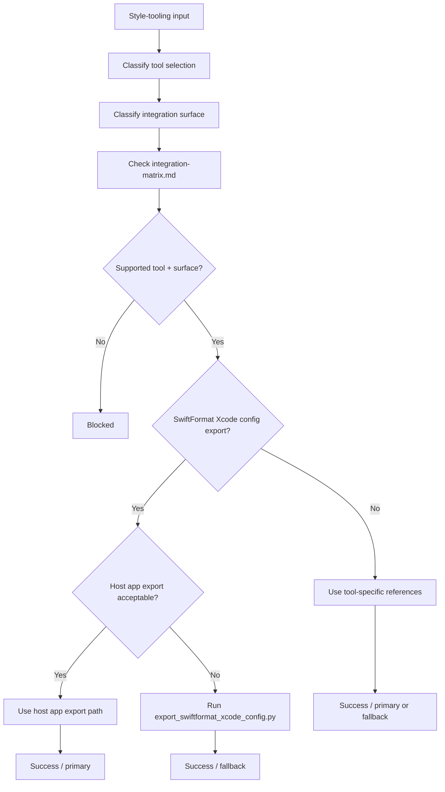

### Branch and Path Notes

- This skill is intentionally about style-tooling setup and maintenance, not general repo bootstrap or Xcode execution.
- The support matrix is part of the contract and should be checked before proposing a path.
- The preferred SwiftFormat settings-export path is the host app export flow.
- When both tools are present, SwiftFormat should own formatting shape and SwiftLint should stay focused on safety, clarity, maintainability, and scoped public-API documentation signal.
- When SwiftFormat behavior depends on Swift language version, prefer a checked-in `.swift-version` file and remember that it overrides a plain `--swift-version` CLI argument.
- The shared-defaults export script is a deterministic fallback for cases where a checked-in `.swiftformat` file is needed from existing host-app settings, and it should prefer the real group-container plist when the suite-domain export is incomplete.
- When a request also includes source cleanup, this skill is the first pass and the final cleanup pass around `structure-swift-sources`.

### Agent ↔ User UX

- Entry:
  - The user asks to add, compare, or maintain SwiftLint or SwiftFormat in a Swift repository.
- Agent behavior:
  - The agent picks the requested tool or tools, resolves the integration surface, checks whether that combination is actually supported, then returns one recommended path plus caveats.
- User-visible response:
  - On success: the user sees the supported path, expected config files, and one verification step.
  - On fallback: the user sees why a secondary path was chosen.
  - On blocked: the user sees the exact unsupported combination or missing prerequisite.

### Failure / Fallback / Handoff States

- `success` + `primary`: a documented preferred path was selected
- `success` + `fallback`: a documented secondary path was selected, such as the SwiftFormat shared-defaults export script
- `handoff`: bootstrap, sync, or Xcode execution should take over next
- `blocked`: the requested tool and surface combination is unsupported or the export prerequisites are missing

## `structure-swift-sources`

### Purpose

Provide the canonical structural-cleanup workflow for Swift repositories, including file splitting, layout normalization, MARK grouping, DocC coverage, and TODO/FIXME ledger extraction.

### Workflow Diagram

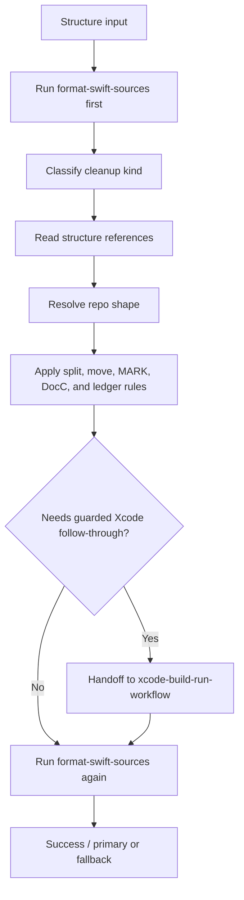

### Branch and Path Notes

- This skill owns source layout and source-organization policy, not formatter or linter integration.
- File splitting stays agent-driven because concern detection and access-control-safe extraction require reasoning.
- The preferred choreography is `format-swift-sources` -> `structure-swift-sources` -> `format-swift-sources`.

### Agent ↔ User UX

- Entry:
  - The user asks to split large Swift files, normalize Swift repo layout, add DocC comments, add MARK sections, or move TODO/FIXME text into ledger files.
- Agent behavior:
  - The agent confirms the formatting baseline, resolves the repo shape, chooses the structural path, and only then performs the cleanup or recommends the narrower safe scope.
- User-visible response:
  - On success: the user sees the structural path, affected layout targets, ledger files, and one verification step.
  - On fallback: the user sees why the scope narrowed to one file or one feature area.
  - On handoff: the user sees why guarded Xcode follow-through is required.

### Failure / Fallback / Handoff States

- `success` + `primary`: the planned structure pass completed
- `success` + `fallback`: a narrower or safer structure pass completed
- `handoff`: Xcode execution or repo-guidance sync should take over next
- `blocked`: the repo shape or mutation safety constraints prevented a clean structure path

## `bootstrap-xcode-app-project`

### Purpose

Provide the canonical new native Apple app bootstrap workflow with one runtime-policy entrypoint and one currently supported mutating path.

### Workflow Diagram

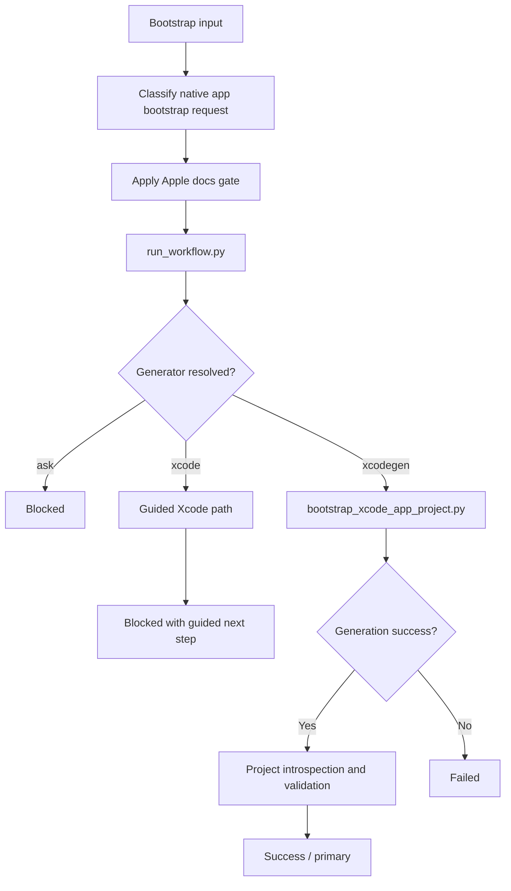

### Branch and Path Notes

- `run_workflow.py` is the local runtime entrypoint.
- The first supported mutating implementation path is `xcodegen`.
- The standard Xcode-created-project path is documented and guided, but not yet safely automated.
- Successful bootstrap hands off existing-project build or run work to `sync-xcode-project-guidance`, then to `xcode-build-run-workflow`, and test work to `xcode-testing-workflow`.

### Inputs

- Required:
  - `name`
- Optional:
  - `destination`
  - `project_kind`
  - `platform`
  - `ui_stack`
  - `project_generator`
  - `bundle_identifier`
  - `org_identifier`
  - `skip_validation`
  - `dry_run`

### Outputs

- `status`
  - `success`
  - `blocked`
  - `failed`
- `path_type`
  - `primary`
  - `fallback`

### Agent ↔ User UX

- Entry:
  - The user asks to start or bootstrap a new native Apple app.
- Agent behavior:
  - The agent applies the Apple docs gate, resolves the generator path, then either runs the supported XcodeGen scaffold path or returns the documented guided Xcode next step.
- User-visible response:
  - On success: the user sees the created repo path and handoff to guidance sync.
  - On blocked: the user sees whether the blocker was generator selection, missing prerequisites, or a guided-only path.
  - On failed: the user sees the concrete generation or validation failure.

### Failure / Fallback / Handoff States

- `success` + `primary`: the XcodeGen-backed bootstrap path completed

## `sync-xcode-project-guidance`

### Purpose

Provide the canonical existing-repo guidance-sync workflow for Xcode app repositories so `xcode-build-run-workflow` and `xcode-testing-workflow` can stay focused on execution.

### Workflow Diagram

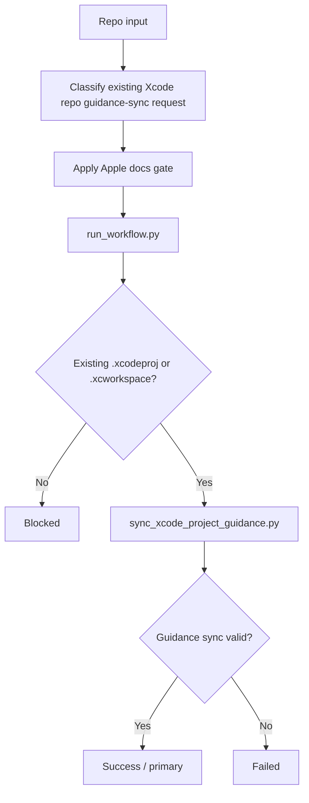

### Branch and Path Notes

- The skill is intentionally bounded to repo-guidance alignment for existing Xcode app repos.
- New-project creation belongs to `bootstrap-xcode-app-project`.
- Active engineering work after sync belongs to `xcode-build-run-workflow` or `xcode-testing-workflow`.

### Agent ↔ User UX

- Entry:
  - The user asks to align or add repo guidance in an existing Xcode app repo.
- Agent behavior:
  - The agent verifies the repo shape, applies the guidance sync script, then hands execution work back to `xcode-build-run-workflow` or `xcode-testing-workflow`.
- User-visible response:
  - On success: the user sees that repo guidance is aligned and what to use next.
  - On blocked: the user sees the exact repo-shape blocker.

### Failure / Fallback / Handoff States

- `success` + `primary`: repo guidance sync completed

## `bootstrap-swift-package`

### Purpose

Provide the canonical new Swift package bootstrap workflow with one runtime-policy entrypoint and one deterministic scaffold path.

### Workflow Diagram

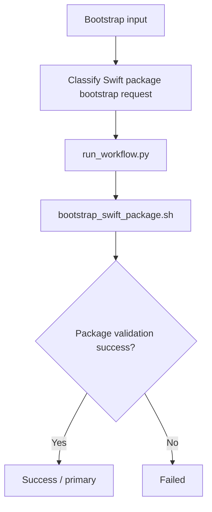

### Branch and Path Notes

- This skill is bounded to plain Swift package creation.
- Within the supported `Swift 5.10+` floor, it prefers current `swift package init` testing-selection flags and only relies on the older default XCTest template when `xctest` is requested and the local CLI exposes no testing-selection flags at all.
- Existing-package guidance sync belongs to `sync-swift-package-guidance`.
- Ordinary package execution after bootstrap belongs to `swift-package-build-run-workflow` or `swift-package-testing-workflow`.
- Xcode-specific execution after bootstrap may belong to `xcode-build-run-workflow` or `xcode-testing-workflow`.

### Agent ↔ User UX

- Entry:
  - The user asks to create a new Swift package.
- Agent behavior:
  - The agent resolves package defaults, runs the deterministic bootstrap path, then hands later guidance-drift work to the sync skill when needed.
- User-visible response:
  - On success: the user sees the created package path and baseline validation.
  - On failed: the user sees the exact scaffold or validation blocker.

### Failure / Fallback / Handoff States

- `success` + `primary`: package bootstrap completed

## `sync-swift-package-guidance`

### Purpose

Provide the canonical existing-repo guidance-sync workflow for plain Swift packages so package bootstrap and Xcode execution can stay focused.

### Workflow Diagram

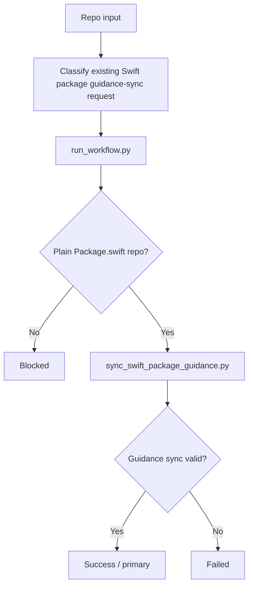

### Branch and Path Notes

- This skill is intentionally bounded to repo-guidance alignment for plain Swift packages.
- New-package creation still belongs to `bootstrap-swift-package`.
- Ordinary package execution now belongs to `swift-package-build-run-workflow` or `swift-package-testing-workflow`, with `swift-package-workflow` preserved only for compatibility routing.
- Xcode-managed package execution may still belong to `xcode-build-run-workflow` or `xcode-testing-workflow`.

### Agent ↔ User UX

- Entry:
  - The user asks to align or add repo guidance in an existing Swift package repo.
- Agent behavior:
  - The agent verifies the repo shape, applies the guidance sync script, then hands ordinary package work back to `swift-package-build-run-workflow` or `swift-package-testing-workflow`, or to `xcode-build-run-workflow` or `xcode-testing-workflow` when Xcode-managed behavior matters.
- User-visible response:
  - On success: the user sees that repo guidance is aligned and what to use next.
  - On blocked: the user sees the exact repo-shape blocker.

### Failure / Fallback / Handoff States

- `success` + `primary`: repo guidance sync completed
